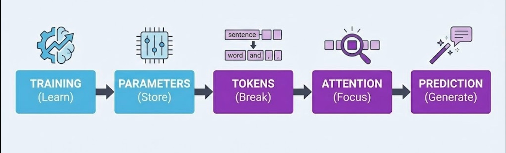

# Generative AI MasterMind

*A beginner Guide*

---

# 1: FUNDAMENTALS OF GENERATIVE AI

## 1.1 What is Generative AI?

**Definition:** Generative AI is software that creates new content (text, images, code, audio and video) by predicting what should come next based on patterns it learned from millions of examples.

### Analogies

**It's like autocomplete on steroids.** When your phone suggests the next word in a text message, that's a tiny version of what GenAI does — except GenAI can predict entire paragraphs, articles, or even code.

**It's like a very well-read parrot.** Imagine a parrot that has "read" the entire internet. It doesn't truly understand what it says, but it's incredibly good at producing text that *sounds* like it understands. It predicts word-by-word what a knowledgeable human would likely say next.

**It's like a jazz musician improvising.** A jazz player learns thousands of songs, then creates new music by combining patterns they've absorbed. GenAI does the same with text — mixing and remixing patterns to create something new.

### Examples in Action

1. **ChatGPT writing an email** — You say "write a polite email declining a meeting," and it generates a full professional email because it's seen millions of similar emails.

2. **DALL-E creating images** — You describe "a cat wearing a spacesuit on Mars" and it creates an image by combining visual patterns of cats, spacesuits, and Mars.

3. **GitHub Copilot writing code** — You start typing a function name and it predicts the entire code block because it's seen similar patterns in millions of code repositories.

4. **ElevenLabs generating audio** — You start typing "record a podcast intro in a confident American accent saying..." and it predicts and generates the full natural voiceover because it's seen patterns in millions of hours of speech data.

5. **Runway ML generating video** — You start typing "animate a robot walking through a cyberpunk city" and it predicts and generates the full smooth video clip because it's seen patterns in millions of video frames and motion sequences.

**The key thing to remember is...** GenAI doesn't "think" or "know" things — it predicts what text/images should come next based on patterns. It's incredibly useful, but it's pattern-matching, not reasoning.


## 1.2 Regular AI vs. Generative AI

**One-sentence difference:** Regular AI finds, sorts, or decides — Generative AI creates something new.

### The Core Difference

| Regular AI | Generative AI |
|------------|---------------|
| Finds existing answers | Creates new content |
| Chooses from what exists | Makes something that never existed |
| "Here's what I found" | "Here's what I made" |

### Analogy: Library vs. Author

**Regular AI is like a librarian.** You ask a question, they search the shelves, and hand you a book that already exists. They're great at finding, organizing, and recommending — but they don't write new books.

**Generative AI is like an author.** You give them a topic, and they write a brand new book that never existed before. It might be inspired by books they've read, but the output is original.


### Examples Side-by-Side

| Task | Regular AI Does This | Generative AI Does This |
|------|---------------------|-------------------------|
| Search | Google finds existing webpages | ChatGPT writes a new answer |
| Images | Google Images finds existing photos | DALL-E creates a new image |
| Music | Spotify recommends existing songs | Suno creates a new song |
| Shopping | Amazon recommends products you might like | AI designs a new product |
| Email | Spam filter sorts into spam/not spam | AI writes a new email for you |
| Driving | Tesla decides: brake or accelerate | — (not a generation task) |

### Simple Diagram


### Types of Regular AI (Non-Generative)

| Type | What It Does | Example |
|------|--------------|---------|
| Classification | Sorts things into categories | Email → Spam or Not Spam |
| Recommendation | Suggests existing items | "You might also like..." |
| Prediction | Forecasts outcomes | "80% chance of rain tomorrow" |
| Detection | Finds patterns/anomalies | Fraud detection on credit cards |
| Recognition | Identifies things | Face unlock on your phone |

*None of these create — they all analyze, sort, or choose.*

### Why This Matters

**Regular AI:** Great for automation, decisions, and finding things. Been around for decades.

**Generative AI:** New capability (mainstream since ~2022). Creates text, images, code, audio, video. This is the "ChatGPT revolution."

**The key thing to remember is...**

Regular AI = **Picker** (chooses from what exists)
Generative AI = **Maker** (creates something new)


*Both are AI. Generative AI is just a specific type that focuses on creation rather than selection.*


## 1.3 Inside the Black Box: How Generative AI Works (Concise)

**One-liner:** GenAI predicts the most likely next word, over and over, based on patterns learned from billions of examples.

### The 5 Stages




### Stage 1: Training

**What:** AI reads billions of webpages/books and learns patterns, not facts.

**Analogy:** A student who reads every library book but memorizes how sentences flow, not specific facts.

```
Sees: "Capital of France is Paris"
      "Capital of Japan is Tokyo"
Learns: "Capital of [country] is [city]" pattern
```


### Stage 2: Parameters

**What:** Patterns stored as billions of numbers (weights).

**Analogy:** Like muscle memory — you can't explain how you ride a bike, but your body "knows."

| Model | Parameters |
|-------|------------|
| GPT-2 | 1.5B |
| GPT-4 | ~1.8T |


### Stage 3: Tokens

**What:** Text broken into chunks (usually word pieces).

**Analogy:** Lego bricks — smaller pieces AI can mix and match.

```
"Explain photosynthesis" →
   ["Explain", " photo", "synth", "esis"]
```

**Why it matters:** Context window, API cost, and speed all measured in tokens.


### Stage 4: Attention

**What:** AI decides which tokens matter most for the answer.

**Analogy:** Highlighting key words in a sentence.

```
"The Eiffel Tower, built in 1889, is in which city?"
       ▲ HIGH ATTENTION                    ▲ HIGH ATTENTION
```

*This is the "T" in GPT — Transformer — the breakthrough that lets AI see all words at once.*


### Stage 5: Prediction

**What:** Predict next token → add it → repeat thousands of times.

**Analogy:** Super-autocomplete.

```
"Best language for beginners is" →
   Python (42%) | JavaScript (18%) | Scratch (12%)...
   → Picks "Python" → Repeats for next word
```


### Temperature (Creativity Dial)


### Common Myths

| Myth | Reality |
|------|---------|
| "AI understands" | It predicts likely responses |
| "AI has a fact database" | Knowledge = compressed patterns |
| "AI remembers our chat" | Re-reads entire history each time |


### Putting It All Together: A Complete Example

Here's what actually happens when you send a prompt to GenAI:


## 1.4 Types of AI Models: Foundational, Proprietary, Open Source

**One-liner:** Foundational models are the "engines" — proprietary means the company keeps the engine secret, open source means anyone can see and modify it. Products like Perplexity and Gamma are "cars" built using these engines.

### The Three Categories


### 1. Foundational Models

**What:** Large pre-trained models that serve as the base "intelligence" — trained on massive data, general-purpose.

**Analogy:** The engine in a car. You don't build an engine from scratch to make a taxi service — you buy one and build around it.

| Characteristic | Description |
|---------------|-------------|
| **Training cost** | $10M - $100M+ |
| **Data** | Trillions of tokens |
| **Purpose** | General-purpose base to build on |
| **Who builds** | Big tech companies |


### 2. Proprietary Models (Closed Source)

**What:** Foundational models where the weights, training data, and code are kept secret. Access via API only.

**Analogy:** Coca-Cola's secret recipe — you can buy the drink, but you can't see how it's made.

| Model | Company | Access |
|-------|---------|--------|
| GPT-4, GPT-4o | OpenAI | API only |
| Claude 3.5/4 | Anthropic | API only |
| Gemini | Google | API only |

**Pros:** Often highest performance, managed infrastructure
**Cons:** No customization, vendor lock-in, data privacy concerns


### 3. Open Source Models

**What:** Foundational models where weights (and sometimes code/data) are publicly available. Download and run yourself.

**Analogy:** A recipe posted online — you can make it at home, modify it, sell your version.

| Model | Company | Parameters |
|-------|---------|------------|
| Llama 3.1 | Meta | 8B - 405B |
| Mistral | Mistral AI | 7B - 8x22B |
| Falcon | TII | 7B - 180B |
| Gemma | Google | 2B - 27B |

**Pros:** Free, customizable, data stays private, no API costs
**Cons:** Need infrastructure, often slightly lower performance


### Where Products Fit: The Application Layer

These companies don't build foundational models — they build products ON TOP of them:


**Analogy:**

| Layer | Car Analogy | AI Example |
|-------|-------------|------------|
| Foundational Model | Engine (Toyota, Ford) | GPT-4, Llama, Claude |
| Application | Car service (Uber, Lyft) | Perplexity, Gamma |
| End User | Passenger | You |

*Uber doesn't manufacture engines — they build a service using cars with existing engines. Same with Perplexity using GPT-4.*


### Quick Comparison

| Aspect | Proprietary | Open Source | App Layer |
|--------|-------------|-------------|-----------|
| **Example** | GPT-4, Claude | Llama, Mistral | Perplexity, Gamma |
| **Cost to use** | Pay per API call | Free (but need hardware) | Subscription |
| **Customization** | Limited | Full control | Use as-is |
| **Data privacy** | Sent to provider | Stays with you | Sent to provider |
| **Best for** | Quick start, best performance | Privacy, cost control, customization | Non-technical users |


### Visual: Who Builds What


## 1.5 The Three Critical Limitations

**GenAI has three major weaknesses:** it can make things up (hallucinations), its knowledge has a cutoff date, and it can only "remember" a limited conversation.

### Limitation 1: Hallucinations

**It's like a confident friend who never admits they don't know something.** Instead of saying "I don't know," GenAI will confidently make up an answer that sounds completely plausible but is totally wrong.

**Examples:**
- Citing research papers that don't exist
- Inventing historical facts with specific (fake) dates
- Creating fake statistics that sound believable

### Limitation 2: Knowledge Cutoff

**It's like talking to someone who's been in a coma since a certain date.** GenAI was trained on data up to a specific point. It has no idea what happened after that — no recent news, no new discoveries, no current events.

**Example:** If the cutoff is January 2024, asking "Who won the 2024 Super Bowl?" will get you a guess, not a fact.

### Limitation 3: Context Window (Memory Limits)

**It's like talking to someone with short-term memory loss.** GenAI can only "remember" a certain amount of your conversation. Share a 100-page document? It might forget the beginning by the time it reaches the end.

```
Conversation Start ←——--------→ Context Limit
[Remembers this clearly]   [Starts forgetting]
```

**The key thing to remember is...** Always verify important facts, check if information might be outdated, and break long documents into smaller chunks.


## 1.6 VERIFY Framework (Using AI Responsibly)

**One-sentence definition:** VERIFY is a 6-step checklist to make sure you're using AI safely and getting accurate results.

### The Framework

| Letter | Meaning | It's Like... |
|--------|---------|--------------|
| **V** | Validate outputs against trusted sources | Double-checking Wikipedia with textbooks |
| **E** | Exclude sensitive data from prompts | Not sharing passwords on social media |
| **R** | Review for bias and accuracy | Getting a second opinion from a friend |
| **I** | Iterate prompts to improve results | Asking follow-up questions until you understand |
| **F** | Flag uncertainty in AI responses | Putting a "?" next to anything you're not sure about |
| **Y** | Your judgment is final | You're the driver, AI is just GPS |

### Analogy

**VERIFY is like being a newspaper fact-checker.** Journalists don't publish the first thing a source tells them. They verify with multiple sources, remove sensitive info, check for bias, ask follow-up questions, note uncertainties, and ultimately make the final call on what to publish.

**The key thing to remember is...** AI is a powerful assistant, but you're responsible for the final output. Always verify before trusting.

---

# 2: PROMPT ENGINEERING

## 2.1 Meta & COSTAR Prompting Frameworks

**One-sentence definition:** Instead of writing prompts yourself, use advanced frameworks like meta-prompting (asking AI to write the prompt) or COSTAR (structured 6-part prompts) for world-class results.

### Meta Prompting

**What it is:** A higher-level technique where you ask the AI to write the prompt for you instead of writing the final instruction yourself.

**How it works:**

```
"I want write to [ Product Requirements Documents (PRD) for an account payable automation solution].

Act as an expert Prompt Engineer. Please write the best possible prompt that I can use
to get a world-class response from you.

Include any necessary context, role-playing personas, or constraints that will make the
output high-quality."
```

**When to use:** When you're unsure how to structure a complex request, or when you want the AI to help you craft the perfect prompt before executing the task.


### COSTAR Framework

**What it is:** COSTAR is a prompt engineering framework used to structure instructions for Large Language Models (LLMs) like GPT-4 or Claude. Instead of asking a vague question, you break your request into six specific components to ensure the AI understands exactly what you need.

**It stands for:**

- **C** - Context (Background information)
- **O** - Objective (The specific task)
- **S** - Style (Writing style or persona)
- **T** - Tone (Emotional attitude)
- **A** - Audience (Who is reading this?)
- **R** - Response (Format of the output)


### Example: Writing a Rejection Email

**Without COSTAR (Bad):**

```
"Write a rejection email to a candidate."
```

**With COSTAR (Good):**

**Context:** I am a hiring manager at a tech startup. We interviewed a junior developer named Alex who was great culturally but lacked the necessary Python experience.

**Objective:** Write a rejection email that encourages them to apply again in 6 months after learning more Python.

**Style:** Professional but human, like a mentor speaking to a student.

**Tone:** Empathetic and encouraging, not cold or corporate.

**Audience:** A young college graduate who is eager to learn.

**Response:** Format as a plain text email body, ready to copy-paste.

**Why the COSTAR version wins:** The AI knows why the candidate was rejected (Context), specific advice to give (Objective), and that it shouldn't sound like a robot (Tone/Style).


### When to Use Meta-Prompt vs COSTAR Framework

**Here's how to decide which strategy to use:**

**Scenario A: I need a specific deliverable** (e.g., A JSON object, a SQL query, or a cold email)
→ **Use COSTAR** — You know what you want, you just need to structure the request clearly.

**Scenario B: I'm not sure how to structure my request or ask**
→ **Use Meta-Prompting** — Let the AI help you design the perfect prompt first, then execute it.


## 2.2 Most Commonly Used Prompt Engineering Techniques

This section provides a comprehensive exploration of 12 prompt engineering techniques with practical examples, use cases, and when to apply each one.

### 1. Zero-Shot Prompting

**When to Use:**
- Simple, well-defined tasks
- LLM has strong prior knowledge of the domain
- No examples available yet
- Quick prototyping or testing

**When NOT to Use:**
- Complex formatting requirements
- Domain-specific jargon or style
- Tasks requiring specific output structure
- Ambiguous instructions where examples would clarify

**Structure:**
```
[Clear instruction] + [Task details] + [Output format]
```

**Bad Example:**
```
Write something about Python error handling.
```
*Problem: Vague scope, no format, no specific angle*

**Good Example:**
```
Explain Python's try-except-finally block in 3 sentences.
Include one code snippet showing proper exception handling.
Target audience: intermediate developers.
```
*Why: Specific scope, format, length, and audience defined*


### 2. Few-Shot Prompting

**When to Use:**
- Specific formatting needed (JSON, tables, templates)
- Style matching required
- Classification tasks
- Pattern recognition needed
- Domain-specific transformations

**When NOT to Use:**
- LLM already understands the format
- Examples are inconsistent or conflicting
- Task is self-explanatory
- Limited context window (examples consume tokens)

**Structure:**
```
[Task description]

Example 1:
Input: [example input]
Output: [example output]

Example 2:
Input: [example input]
Output: [example output]

Now apply to:
Input: [actual input]
Output:
```

**Bad Example:**
```
Convert to JSON:
Name: John, Age: 30
Name: Sarah, Age: 25

Convert: Name: Mike, Age: 40
```
*Problem: Inconsistent formatting, no field definitions*

**Good Example:**
```
Extract structured data from user messages:

Example 1:
Input: "I need a flight to NYC on Dec 15th"
Output: {"type": "flight", "destination": "NYC", "date": "2024-12-15"}

Example 2:
Input: "Book hotel in Paris for 3 nights starting Jan 5"
Output: {"type": "hotel", "location": "Paris", "duration": "3 nights", "start_date": "2025-01-05"}

Extract from: "Reserve rental car in Miami from Feb 10-12"
Output:
```
*Why: Consistent structure, clear field mapping, diverse examples*


### 3. Chain-of-Thought (CoT)

**When to Use:**
- Multi-step reasoning required
- Mathematical or logical problems
- Complex decision-making
- Debugging or analysis tasks
- Need to verify reasoning path

**When NOT to Use:**
- Simple retrieval or lookup tasks
- When only final answer matters (tokens are precious)
- Real-time/low-latency requirements
- Creative writing (can make it mechanical)

**Structure:**
```
[Task] + "Think step-by-step" OR "Show your reasoning before answering"
```

**Bad Example:**
```
Calculate the ROI of our marketing campaign. Think step-by-step.
```
*Problem: Missing data, unclear what steps to show*

**Good Example:**
```
Calculate marketing ROI with this data:
- Campaign cost: $10,000
- Revenue generated: $45,000
- Attribution: 60% direct, 40% assisted

Think step-by-step:
1. Calculate attributed revenue
2. Subtract campaign cost
3. Compute ROI percentage
4. Explain if this meets our 3x ROI target
```
*Why: Data provided, specific steps outlined, clear success criteria*


### 4. ReAct (Reasoning + Acting)

**When to Use:**
- Multi-tool workflows (search → analyze → generate)
- Agent-based systems
- Tasks requiring external information
- Dynamic decision-making (if X then Y)
- N8N workflows with branching logic

**When NOT to Use:**
- Single-step tasks
- No external tools available
- Linear workflows (use prompt chaining instead)
- When reasoning overhead isn't needed

**Structure:**
```
Task: [goal]
Available tools: [list]

For each step:
Thought: [reasoning]
Action: [tool_name(parameters)]
Observation: [result]
... (repeat until)
Answer: [final response]
```

**Bad Example:**
```
Search for Python tutorials and summarize them.
Tools: web_search
```
*Problem: No reasoning structure, unclear iteration*

**Good Example:**
```
Find the latest Python 3.12 async features and create a code example.

Available tools: web_search(query), web_fetch(url)

Thought: I need recent documentation about Python 3.12 async features
Action: web_search("Python 3.12 async new features")
Observation: [results show TaskGroups and asyncio improvements]

Thought: Need official documentation for accuracy
Action: web_fetch("https://docs.python.org/3.12/whatsnew/3.12.html")
Observation: [full docs retrieved]

Thought: Now I can create accurate example
Answer: [code example with TaskGroups]
```
*Why: Clear thought → action → observation loop, explicit reasoning*


### 5. Role-Based Prompting

**When to Use:**
- Domain expertise needed (legal, medical, technical)
- Specific perspective required
- Tone/style customization
- Technical documentation
- Code review or architecture decisions

**When NOT to Use:**
- Generic tasks where role doesn't add value
- Over-specification that constrains creativity
- When expertise might introduce bias

**Structure:**
```
You are a [specific role with expertise].
Your task is [goal].
Approach this as [persona] would, focusing on [domain aspects].
```

**Bad Example:**
```
You are an expert. Write Python code for data processing.
```
*Problem: Vague expertise, no specific domain knowledge leveraged*

**Good Example:**
```
You are a senior data engineer specializing in real-time ETL pipelines using Python, Apache Kafka, and AWS.

Review this data ingestion code for:
- Scalability issues (target: 10K events/sec)
- Error handling in streaming contexts
- Memory leaks in long-running processes
- Best practices for backpressure handling

[code here]
```
*Why: Specific expertise, measurable criteria, domain context*


### 6. Prompt Chaining

**When to Use:**
- Complex workflows (RAG pipelines)
- Quality > speed
- Each step needs different specialization
- Intermediate outputs need validation
- N8N automation sequences

**When NOT to Use:**
- Simple single-step tasks
- Real-time requirements
- Limited API calls budget
- When outputs don't build on each other

**Structure:**
```
Prompt 1: [specialized task A] → Output A
Prompt 2: Use Output A to [specialized task B] → Output B
Prompt 3: Use Output B to [final task] → Final Output
```

**Bad Example:**
```
Chain:
1. Summarize this article
2. Make it better
3. Add hashtags
```
*Problem: Vague objectives, no clear specialization per step*

**Good Example:**
```
CHAIN 1 - Query Rewriting:
User query: "python async stuff"
Rewrite as 3 specific search queries optimized for technical documentation.
Output: {{search_queries}}

CHAIN 2 - Retrieval Ranking:
Retrieved docs: {{retrieved_chunks}}
Rank by relevance to: {{search_queries}}
Return top 5 with confidence scores.
Output: {{ranked_docs}}

CHAIN 3 - Synthesis:
Context: {{ranked_docs}}
Original query: "python async stuff"
Generate answer with:
- Code examples
- Citations (doc IDs)
- Confidence score (0-1)
Output format: JSON
```
*Why: Each step has clear input/output, specialization, structured flow*


### 7. Constraint-Based Prompting

**When to Use:**
- Need to prevent specific behaviors
- Format compliance (legal, regulatory)
- Brand guidelines enforcement
- API response requirements
- Content moderation

**When NOT to Use:**
- Over-constraining kills creativity
- Constraints conflict with each other
- Simple tasks where flexibility is fine

**Structure:**
```
[Task]

MUST include: [requirements]
MUST NOT include: [prohibitions]
Format: [structure]
Length: [bounds]
```

**Bad Example:**
```
Write a blog post. Keep it professional.
```
*Problem: "Professional" is subjective, no measurable constraints*

**Good Example:**
```
Write a product description for enterprise RAG platform.

MUST include:
- One quantified benefit (e.g., "40% faster retrieval")
- One integration mention (Pinecone, Weaviate, or ChromaDB)
- Use case example from finance OR healthcare

MUST NOT include:
- Marketing fluff ("revolutionary", "game-changing")
- Unverified claims
- Technical jargon not explained
- More than 150 words

Format: 3 paragraphs with subheadings
Tone: Technical but accessible
```
*Why: Specific inclusions/exclusions, measurable limits, clear structure*


### 8. Self-Consistency Sampling

**When to Use:**
- High-stakes decisions (medical, legal, financial)
- Ambiguous problems with multiple valid approaches
- Need confidence estimation
- Quality > cost

**When NOT to Use:**
- Deterministic tasks (formatting, data extraction)
- Budget constraints (requires multiple API calls)
- Real-time systems
- Tasks with single correct answer

**Structure:**
```
Generate N different reasoning paths for:
[problem]

Compare answers and:
1. Identify consensus answer
2. Note divergent reasoning
3. Provide confidence score based on agreement
```

**Bad Example:**
```
Give me 3 answers to: What's the capital of France?
```
*Problem: Deterministic question, no value in multiple samples*

**Good Example:**
```
A startup has $500K funding and two options:
Option A: Hire 5 engineers ($400K/year) + minimal marketing
Option B: Hire 2 engineers ($160K/year) + $200K marketing + freelancers

Generate 3 independent analyses considering:
- 18-month runway
- B2B SaaS product (0 revenue currently)
- Technical complexity requires strong team

For each analysis:
1. Compute runway for each option
2. Assess risk factors
3. Recommend option

Then: Compare recommendations and explain consensus or disagreement.
```
*Why: Ambiguous problem, multiple valid approaches, genuine uncertainty*


### 9. Meta-Prompting (Prompt Generation)

**When to Use:**
- Building prompt templates for non-technical users
- Creating N8N workflow prompt libraries
- A/B testing prompt variations
- Teaching prompt engineering

**When NOT to Use:**
- Direct task execution (just do the task instead)
- Over-engineering simple prompts
- When you already have proven prompts

**Structure:**
```
Generate a prompt for [use case] that:
- Handles [input type]
- Produces [output format]
- Includes [specific constraints]
- Uses [technique name] technique

Provide 3 variations: basic, intermediate, advanced.
```

**Bad Example:**
```
Make me a prompt for summarizing.
```
*Problem: No specifications, no use case context*

**Good Example:**
```
Generate a prompt template for N8N workflow that:

Use case: Summarize customer support tickets
Input: {{ticket_text}} (variable length, 50-500 words)
Output: JSON with keys: {summary, sentiment, priority, suggested_action}

Requirements:
- Use few-shot learning with 2 examples
- Include constraint: summary max 50 words
- Add instruction for extracting action items
- Specify priority scale: low/medium/high/urgent

Provide:
1. The complete prompt template
2. Example with sample ticket
3. Expected output for the example
```
*Why: Complete specifications, structured deliverable, actionable template*


### 10. Negative Prompting

**When to Use:**
- Preventing known unwanted patterns
- Removing verbose AI behaviors (apologies, disclaimers)
- Content filtering
- Style refinement

**When NOT to Use:**
- Over-constraining creative tasks
- When positive instructions are clearer
- Adding too many negatives (confusing)

**Structure:**
```
[Task]

DO NOT:
- [behavior 1]
- [behavior 2]
- [behavior 3]
```

**Bad Example:**
```
Write code. Don't make mistakes.
```
*Problem: "Mistakes" is too vague*

**Good Example:**
```
Generate Python function for API rate limiting.

DO NOT:
- Include apologies or explanatory preamble
- Use time.sleep() (use asyncio instead)
- Add print statements (use logging module)
- Write comments explaining obvious code
- Include error handling for network issues (caller handles this)

DO:
- Use decorator pattern
- Include type hints
- Return remaining quota in response
```
*Why: Specific behaviors prevented, balanced with positive instructions*


### 11. Output Structuring

**When to Use:**
- API integrations (N8N, Zapier)
- Data parsing requirements
- Multi-field extraction
- Downstream processing in pipelines

**When NOT to Use:**
- Human-only consumption (prose is fine)
- Format complexity exceeds task value
- LLM struggles with strict JSON (use XML instead)

**Structure:**
```
[Task]

Return ONLY valid JSON with this exact structure:
{
  "field1": "type",
  "field2": ["array", "of", "items"],
  "nested": {
    "field3": "value"
  }
}

No markdown code blocks, no explanations, pure JSON only.
```

**Bad Example:**
```
Extract info from this email and give me JSON:
[email content]
```
*Problem: No schema defined, "info" is ambiguous*

**Good Example:**
```
Extract meeting details from email:

[email: "Let's meet Tuesday at 2pm at Coffee Shop on Main St to discuss Q4 budget"]

Return ONLY this JSON structure (no markdown, no explanations):
{
  "meeting_date": "YYYY-MM-DD or null if not specific",
  "meeting_time": "HH:MM or null",
  "location": "string or null",
  "attendees": ["array of names mentioned"],
  "topics": ["array of discussion topics"],
  "action_items": ["array or empty"],
  "confidence": 0.0-1.0
}

If any field cannot be determined, use null. Always include confidence score.
```
*Why: Exact schema, data types, null handling, parsing rules clear*


### 12. Iterative Refinement Prompting

**When to Use:**
- Complex deliverables (reports, documentation)
- Collaborative AI workflows
- Learning user preferences
- Quality improvement cycles

**When NOT to Use:**
- Simple one-shot tasks
- Stateless API calls (no conversation memory)
- Time-sensitive requests

**Structure:**
```
Iteration 1: Generate [draft]
Iteration 2: Critique your output for [criteria]
Iteration 3: Revise based on critique
```

**Bad Example:**
```
Write an article. Then make it better.
```
*Problem: "Better" undefined, no critique criteria*

**Good Example:**
```
Task: Create RAG system architecture diagram description

Iteration 1: Write technical description of components
Iteration 2: Self-critique against these criteria:
- Are all data flows explained?
- Is latency at each stage mentioned?
- Are error handling paths covered?
- Would a senior engineer spot gaps?

Iteration 3: Revise description addressing each critique point

Iteration 4: Add one-paragraph "Scaling Considerations" section
```
*Why: Specific improvement criteria, staged refinement, measurable progress*


### Combining Techniques (Advanced)

**RAG Pipeline Example:**
```
1. Few-Shot + Output Structuring: Query rewriting
2. Constraint-Based: Filter retrieval results
3. CoT: Rank documents by relevance
4. Role-Based + Negative: Generate answer (expert tone, no disclaimers)
5. Output Structuring: Format as JSON with citations
```

This combination creates a production-ready RAG response in a structured, repeatable way.


### Practice Exercise

**Build a RAG pipeline prompt that:**
1. Rewrites user query for better retrieval
2. Ranks retrieved chunks by relevance
3. Synthesizes answer with citations
4. Returns JSON with confidence score

**Solution Framework:**

```
# Step 1: Query Rewriting (Few-Shot + Output Structuring)
Original query: {{user_query}}

Rewrite into 3 optimized search queries:
Example: "python async" → ["python asyncio library", "async await python syntax", "python asynchronous programming tutorial"]

Output: ["query1", "query2", "query3"]

# Step 2: Ranking (CoT + Role-Based)
You are a search relevance engineer.

Retrieved chunks: {{chunks}}
Queries: {{rewritten_queries}}

Think step-by-step:
1. Score each chunk against each query (0-1)
2. Calculate weighted average
3. Rank top 5 chunks

Output JSON: [{"chunk_id": "x", "score": 0.95, "reason": "..."}, ...]

# Step 3: Synthesis (Constraint-Based + Negative)
Context: {{top_chunks}}
Original query: {{user_query}}

Generate answer:
MUST include: Code examples, citations [1], [2]
MUST NOT: Apologize, use disclaimers, exceed 200 words

# Step 4: Final Output (Output Structuring)
Return ONLY this JSON:
{
  "answer": "string",
  "citations": [{"id": 1, "chunk_id": "x", "relevance": 0.95}],
  "confidence": 0.85,
  "suggested_followups": ["question1", "question2"]
}
```


### Key Takeaways

1. **Match technique to task complexity** - Don't over-engineer simple prompts
2. **Token costs matter** - CoT and chaining are expensive; use strategically
3. **Examples beat instructions** - Few-shot works when explanations fail
4. **Structure enables automation** - JSON output is essential for N8N workflows
5. **Combine techniques** - Real systems need 3-5 techniques working together
6. **Test iteratively** - Start simple, add complexity based on failures
7. **Document patterns** - Save successful prompts as templates


### Additional Resources

- **Anthropic Prompt Engineering Guide**: https://docs.claude.com/en/docs/build-with-claude/prompt-engineering/overview
- **N8N AI Documentation**: For workflow integration patterns
- **LangChain Prompts**: Template library for inspiration


*Prompt Engineering Techniques Guide - Version 1.0 - January 2026*

---

# 3: CONTEXT ENGINEERING

## 3.1 What is Context Engineering?

**One-sentence definition:** Context engineering is the discipline of designing dynamic systems that provide the right information, at the right time, to an LLM — so it can produce the best possible output.

### Beyond Prompt Engineering

Prompt engineering is about crafting a single, static instruction. Context engineering is the next evolution — it's about **building systems** that dynamically assemble all the pieces an LLM needs to succeed.

**It's like the difference between writing a recipe card and running a kitchen.** A recipe card (prompt) tells you what to do. But running a kitchen (context engineering) means making sure the right ingredients are prepped, the right tools are on the counter, and the right reference books are open — all before the chef starts cooking.

### Where Context Comes From

An LLM doesn't just receive your prompt. It receives context from multiple sources:

| Context Source | Example |
|---------------|---------|
| **Developer-provided context** | System prompts, instructions, rules |
| **User input** | The current question or request |
| **Previous interactions** | Conversation history |
| **Tool call results** | Data retrieved from APIs, databases, files |
| **External data** | Documents, search results, memory files |

**The key insight:** Prompts are static. But these pieces of context are **extremely dynamic** — and if the context is dynamic, then the system that constructs it must be dynamic too.


## 3.2 Why Context Engineering Matters

**One-sentence summary:** Garbage in, garbage out — an LLM can only be as good as the context it receives.

### Analogy: The Open-Book Exam

**Context engineering is like preparing for an open-book exam.** Having the right textbook, opened to the right page, with the right notes highlighted — that's what determines your score. The smartest student in the world will fail if their book is missing chapters, opened to the wrong page, or full of incorrect sticky notes.

The same is true for LLMs. Even the most powerful model will underperform if it:
- **Lacks necessary information** — like asking someone to fix a bug without showing them the code
- **Has too much irrelevant information** — like handing someone a 500-page manual when they need one paragraph
- **Receives contradictory instructions** — like telling someone "be concise" and "be thorough" at the same time

### Why It Applies to Everyone

Context engineering isn't just for developers building AI agents. It matters for:

- **Developers** building tools like Cursor, Claude Code, or custom AI agents
- **Users** interacting with AI assistants (how you structure your requests is context engineering)
- **Teams** setting up shared AI workflows and memory systems


## 3.3 The Context Problem: When Things Go Wrong

**One-sentence definition:** As AI agents work on longer tasks, three types of context failure can degrade their performance — poisoning, confusion, and clash.

### The Growing Context Problem

When an AI agent works on a long task, its context window grows continuously — tool call results accumulate, conversation history expands, and eventually:
- The context **exceeds window limits** (the LLM literally can't see everything)
- **Cost and latency increase** (more tokens = more time and money)
- **Performance degrades** (the model gets "lost" in the noise)

### The Three Context Failures

| Failure Type | What Happens | Analogy |
|-------------|-------------|---------|
| **Context Poisoning** | Tool calls introduce hallucinated or incorrect data into the context | Eating spoiled food — one bad ingredient ruins the whole meal |
| **Context Confusion** | Unnecessary or irrelevant context influences the response | Studying the wrong textbook chapter before an exam |
| **Context Clash** | Contradictory context segments pull the model in different directions | Getting opposite advice from two doctors at the same time |

**The key thing to remember is...** Context engineering isn't just about *adding* information — it's equally about **filtering, organizing, and managing** what the LLM sees.


## 3.4 Architecting Memory: The Three-Tier Hierarchy

**One-sentence definition:** Effective context engineering uses a layered memory system — shared project knowledge, personal preferences, and dynamic imports — so the right context is always available.

### Analogy: A Company's Knowledge System

Think of it like how a company organizes knowledge:
- **Company wiki** (Project Memory) — shared standards everyone follows
- **Personal notebook** (User Memory) — your shortcuts, preferences, notes
- **Reference library** (Dynamic Imports) — specialized docs you pull in when needed

### Tier 1: Project Memory

**What it is:** Shared context about architecture, standards, and conventions that applies to the entire project.

- Version-controlled (lives in the repo)
- Available to all team members
- Defines how the project works

**Example:** A `CLAUDE.md` file at the project root that says: *"This project uses TypeScript, Jest for testing, and follows the repository pattern for data access."*

### Tier 2: User Memory

**What it is:** Personal preferences and shortcuts specific to an individual user.

- Stored locally (e.g., `~/.claude/claude.md`)
- Not committed to the repository
- Persists across sessions

**Example:** Your personal memory file might say: *"I prefer concise responses. Always use dark mode examples. I'm experienced with React but new to Python."*

### Tier 3: Dynamic Memory Imports

**What it is:** On-demand context pulled in for specific tasks using references or triggers.

- Imported using `@` syntax or automatic scanning
- Dedicated files for specific topics (API docs, style guides, etc.)
- Can be dynamically updated based on factors like git branch or current task

**Example:** Typing `@api-standards.md` in a prompt to pull in your team's API naming conventions before generating an endpoint.

### How the Tiers Work Together


## 3.5 Context Management Strategies

**One-sentence definition:** Three core strategies — intelligent retrieval, compression, and isolation — keep context useful and prevent the failures described in 3.3.

### Strategy 1: Intelligent Context Retrieval

**It's like a smart assistant who knows what to put on your desk before you ask.** Instead of dumping everything into the context, the system selectively retrieves what's most relevant.

How it works:
- **Automatic folder scanning** — discovers helpful context files nearby
- **Inheritance** — inherits context from parent folders (project-level → folder-level → file-level)
- **Recency prioritization** — recently used information ranks higher
- **Tool-aware retrieval** — different tools trigger different context lookups

**Example by Tool Type:**

| Tool | What Context Gets Retrieved |
|------|----------------------------|
| **Code editor** | Existing code style, similar functions, imports |
| **Terminal** | Available npm scripts, file paths, environment info |
| **Search** | Relevant docs, previous similar queries |

### Strategy 2: Context Compression

**It's like writing a summary of a long meeting.** As conversations grow, you need ways to keep the essential information without the bloat.

Two key techniques:
- **Reset** — Removes conversation history entirely while preserving memory files (starts fresh but still "knows" your project)
- **Compact** — Compresses the conversation into its essential information (keeps the key facts, discards the back-and-forth)

**When to use each:**

| Technique | Use When |
|-----------|----------|
| **Reset** | Switching to a completely different task |
| **Compact** | Continuing the same task but the conversation is getting long |

### Strategy 3: Context Isolation

**It's like assigning specialists instead of asking one person to do everything.** Instead of one agent with a massive, confused context, create focused sub-agents with only the context they need.


**Benefits:**
- Reduces context confusion (each agent only sees what it needs)
- Improves focus and task execution
- Prevents context clash between unrelated tasks


## 3.6 System Prompts: The Goldilocks Zone

**One-sentence definition:** The best system prompts are "not too specific, not too vague, but just right" — they provide principles and reasoning frameworks rather than rigid flowcharts.

### Analogy: Training a New Employee

**Too specific** is like giving a new employee a 200-page script for every possible customer interaction — they can't handle anything unexpected.

**Too vague** is like saying "just help the customer" with no guidance — every interaction will be inconsistent.

**Just right** is like teaching them your company values, giving them a reasoning framework, and trusting them to apply it — they handle novel situations well.

### The Problem with Being Too Specific

| Issue | Example |
|-------|---------|
| Treats LLM as a deterministic machine | "Always ask exactly 3 follow-up questions" |
| Hard-coded logic | Exhaustive if/then scenarios for every case |
| Forces predetermined paths | "If user says X, respond with Y" |
| Maintenance nightmare | Every new edge case needs a new rule |

### The Problem with Being Too Vague

| Issue | Example |
|-------|---------|
| Insufficient signal | "Be helpful" (helpful how?) |
| Assumes shared context | "Follow our process" (what process?) |
| Undefined boundaries | No clarity on what the agent should NOT do |
| Inconsistent behavior | Different outputs every time for the same input |

### The Optimal Approach: Principles Over Prescriptions

The best system prompts have four components:

**1. Clear Identity and Scope**
- Establishes what the agent is and what domain it operates in
- Defines the boundary between basic and complex operations

**2. Empowerment Over Constraint**
- Sets goals instead of prescribing specific tools
- Trusts the agent's selection and reasoning
- Provides frameworks, not flowcharts

**3. Reasoning Framework**
```
→ Identify the core issue
→ Gather necessary context
→ Provide clear resolution
→ Confirm satisfaction
```

**4. Clear Boundaries as Heuristics**
- Example principle: *"Always choose the simplest solution"*
- Acts like a greedy algorithm — a general rule the agent applies to specific situations

### Why This Works

**It's like teaching someone to fish vs. giving them a fish for every possible meal.** Principles leverage what LLMs are best at — **recognizing patterns and applying general rules to specific situations.** A few well-crafted principles replace hundreds of enumerated edge cases, avoid contradictory instructions, and handle novel situations gracefully.

**The key thing to remember is...** Write system prompts that teach your AI *how to think*, not *what to say*. Compressed principles beat exhaustive scripts every time.


## 3.7 Key Takeaways

| Principle | Summary |
|-----------|---------|
| **Context > Prompts** | Dynamic context systems matter more than static prompt text |
| **Garbage In, Garbage Out** | LLMs can only be as good as the context they receive |
| **Watch for Failures** | Context poisoning, confusion, and clash degrade performance |
| **Architect Memory** | Use a three-tier hierarchy: project, user, and dynamic imports |
| **Manage Actively** | Retrieve intelligently, compress regularly, isolate by task |
| **Goldilocks Prompts** | System prompts should teach principles, not prescribe scripts |

*Context Engineering Guide - Version 1.0 - March 2026*

---

# 4: MODEL CONTEXT PROTOCOL (MCP)

## 4.1 Why Do We Need MCP?

**One-sentence definition:** MCP (Model Context Protocol) is a standardization layer that lets developers build a tool integration once and have it work across every AI application that supports the protocol.

### The Problem: Custom Integration Hell

Traditional AI agent development requires custom implementation of every tool integration. Want your agent to talk to Slack, Gmail, and a database? You write custom code for each one, wrap them as tools, and wire them into your agent.

Frameworks like LangChain provide some built-in tools, but custom solutions are often necessary — for example, restricting Gmail to read-only access so your agent can't delete emails.

### The Scaling Problem

When an agent becomes successful and other developers want to use it in different platforms (Cursor, Windsurf, Lovable, GitHub Copilot), the code has to be duplicated and adapted for each one:

```
Without MCP:

Agent Tool (e.g., Gmail integration)
  ├── Custom code for Cursor
  ├── Custom code for Windsurf
  ├── Custom code for Claude Desktop
  ├── Custom code for GitHub Copilot
  └── Custom code for Lovable

  = 5 separate implementations to maintain
```

**It's like building a phone charger that only works with one brand of outlet.** Travel to a new country? Build a new charger. MCP is the universal adapter — build one charger, plug it in anywhere.

### MCP as an Abstraction Layer

Following established computer science principles, MCP adds a standardization layer:

| Without MCP | With MCP |
|-------------|----------|
| Build separate integrations per platform | Build once, works everywhere |
| Migrating tools = rewriting code | Migrating tools = zero effort |
| Each platform reinvents the wheel | Shared ecosystem of tools |
| N tools × M platforms = N×M integrations | N tools + M platforms = N+M integrations |

**It's like the USB standard.** Before USB, every device had a proprietary connector. USB said "here's one protocol" — and suddenly any device works with any computer. MCP does the same for AI tool integrations.

### Network Effects

MCP operates like a social network — it becomes more valuable as adoption grows:
- Millions of developers building and sharing tools
- Extensive community-generated integrations
- Powerful ecosystem flywheel: more tools → more platform adoption → more tools
- A single developer's MCP server instantly works with every supporting application


## 4.2 How MCP Works: Architecture

**One-sentence definition:** MCP uses a client-server architecture where AI applications (hosts) contain clients that communicate with external MCP servers, which expose tools, resources, and prompts through a standardized protocol.

### Core Concept

*"The Model Context Protocol standardizes how applications provide context to LLMs."* Context here includes additional prompt information, tool invocations, and prompt content itself.

### Architecture Components


### Component Breakdown

| Component | What It Does | Analogy |
|-----------|-------------|---------|
| **MCP Host** | The AI application (Claude Desktop, Cursor, etc.) | The building that houses offices |
| **MCP Client** | Sits inside the host; communicates with one server | A phone line to one external office |
| **MCP Server** | Exposes tools, resources, and prompts to clients | An external service provider |
| **MCP Protocol** | The standardized communication format | The language both sides speak |

### What MCP Servers Expose

MCP servers can provide three types of capabilities:

| Capability | Description | Example |
|-----------|-------------|---------|
| **Tools** | Functions the LLM can invoke | `get_forecast(lat, lon)`, `send_message(channel, text)` |
| **Resources** | Data the LLM can access | PDFs, documents, database records |
| **Prompts** | Pre-built prompt templates | Specialized instructions for specific tasks |

### Important Constraint

**One client connects to one server.** If your host needs three MCP servers, it runs three separate MCP clients — one per server. This keeps each connection clean and isolated.

### Key Advantages

1. **Extensive integration library** — Plug-and-play access to thousands of community-built integrations
2. **Vendor independence** — Not coupled to any specific LLM vendor or application builder
3. **Tool portability** — Write tools once, migrate across different platforms seamlessly
4. **Comparable to framework approaches** — Similar functionality to LangChain tools but with standardized implementation


## 4.3 MCP in Action: Real-World Examples

**One-sentence definition:** MCP transforms AI assistants from general knowledge tools into action-capable agents that interact with real-world services — from checking weather to ordering food.

### Example: Ordering Food Through AI

Eric Dickerson created an MCP server that enables Cursor to order food through Uber Eats:
1. User requests a specific dish via natural language
2. MCP server filters menu options
3. Results presented for user confirmation
4. Order executed through tool invocation
5. Works across any MCP-supporting application (Claude Desktop, Windsurf, etc.)

### Before MCP: Claude Desktop

**Query:** "What's the weather in San Francisco?"

**Result:** The LLM responds that it lacks access to real-time weather data. It can only provide general climate information based on training data.

### After MCP: Claude Desktop

**Settings > Developer:** Weather MCP server configured

**Query:** "What is the weather in San Francisco right now?"

**What happens behind the scenes:**
1. User approval prompt for tool execution
2. LLM deduces San Francisco's latitude/longitude
3. MCP server calls `get_forecast` with those coordinates
4. Weather data returned and processed
5. Final answer provided with current weather information

### After MCP: Cursor

**Cursor Settings > MCP Tab:** Lists all connected MCP servers with available tools (`get_alerts`, `get_forecast`)

**Query:** "What is the weather in San Francisco right now?"

**What happens:**
1. Agent mode required for MCP functionality
2. `get_forecast` tool called via RPC
3. Cursor automatically also calls `get_alerts` for weather alerts
4. Comprehensive answer returned including forecast and active alerts

**The key thing to remember is...** The same MCP server works identically in Claude Desktop and Cursor — no code changes needed. That's the power of standardization.


## 4.4 Hands-On: Setting Up an MCP Server

**One-sentence definition:** Setting up an MCP server can be as simple as a single CLI command — here's a walkthrough using Context7, a remote MCP that provides up-to-date documentation for AI packages.

### What is Context7?

- Indexes approximately 30,000 packages
- Provides current documentation for frequently-changing AI libraries
- Runs as a remote MCP (HTTP transport) on Context7's servers, not locally
- Enables code generation with the latest package APIs

### Installation

CLI approach recommended over manual file configuration:

```bash
claude mcp add context7 --transport http --url <context7-url> --scope project
```

This creates a configuration file with the transport type and URL. After restarting Claude Code, it prompts for MCP server connection permission.

### Available Tools

| Tool | Purpose |
|------|---------|
| `resolve_library_id` | Identify the target package (e.g., "langgraph" → official library ID) |
| `get_library_docs` | Retrieve relevant, up-to-date documentation for that package |

### Practical Example

**Query:** "What is the latest version of LangGraph? Use Context7 MCP."

**Process:**
1. Permission request for tool invocation
2. `resolve_library_id` identifies the LangGraph package
3. `get_library_docs` retrieves current documentation
4. Latest version identified from indexed docs

### Custom Memory for Consistent MCP Usage

You can create project-level memory instructions so MCP tools are used automatically:

```
# Add to project memory:
"Every time I ask about LangGraph, use Context7 MCP"
```

This persists across sessions — after a restart, queries about LangGraph will automatically invoke Context7.


## 4.5 Context Engineering in MCP

**One-sentence definition:** Context is the most expensive and limited resource in agentic systems — loading unnecessary MCP tool definitions bloats the context window and degrades agent performance.

### The Context Bloat Problem

**It's like packing every tool you own for a weekend trip.** You only need a screwdriver, but you brought the entire garage. Now your suitcase is too heavy to carry and you can't find the screwdriver anyway.

**Traditional setup problem:**
- Project-level MCP config loads **all** configured servers simultaneously
- All tools from every server are present in the context window
- Results in tens of thousands of tokens consumed before the first user prompt
- Tools irrelevant to the current task waste precious context space

### The Impact: Real Numbers


### Solution 1: Configuration-Level Control

**Strict MCP config** — load only the MCP servers you need for a specific task:

```bash
claude code --mcp-config ./my-config.json --strict-mcp-config
```

| Setting | Effect |
|---------|--------|
| `--mcp-config` | Points to a specific config file |
| `--strict-mcp-config` | Ignores default MCP hierarchy, loads only specified servers |
| **Result** | MCP tools drop from ~20% to ~2.4% of context |

### Solution 2: Session-Level Control

Within the Claude interface:
- Access MCP servers in settings
- Disable unnecessary servers per session
- Toggle individual servers on/off
- Context reduction maintained (~3.2% for reduced toolset)

### The Principle

**It's like the difference between a toolbox and a hardware store.** A professional brings a curated toolbox to each job — not the entire store inventory. Match available tools to the specific task rather than loading everything "just in case."

**The key thing to remember is...** Context engineering requires matching available tools to specific task requirements. Loading comprehensive but irrelevant tool suites hurts performance, increases cost, and slows responses.


## 4.6 Claude Code Plugins

**One-sentence definition:** Plugins bundle slash commands, subagents, MCP servers, and hooks into shareable packages — enabling teams and communities to share complete AI workflows with a single install.

### The Problem Before Plugins

Setting up a complete AI development environment required manual labor:
- Copy slash commands from repositories into your Claude directory
- Repeat the process for subagents and hooks
- Separately configure MCP servers
- Repeat all of this for every team member

**It's like building IKEA furniture without the instruction manual — from loose parts scattered across different warehouses.** Plugins are the pre-assembled kit with everything in one box.

### What Plugins Bundle

| Component | What It Does | Example |
|-----------|-------------|---------|
| **Slash commands** | Custom commands triggered with `/` | `/feature-dev` for feature implementation |
| **Subagents** | Specialized AI agents for specific tasks | Code Reviewer, Code Architect |
| **MCP servers** | Tool integrations | Database access, API connections |
| **Hooks** | Automated triggers and behaviors | Pre-commit checks, auto-formatting |

### Plugin Installation

```
/plugin → Add marketplace URL → Browse available plugins → Select and install
```

**Marketplace system:** A `marketplace.json` file describes available plugins with names, descriptions, and source URLs. Teams or communities host their own marketplaces.

### Practical Example: Feature Dev Plugin

**Task:** Add a new GitHub branch reference to a README table

**Process with `/feature-dev`:**
1. Discovery phase — describe the feature
2. Examine current README structure and branch content
3. Check main branch for existing table
4. Generate appropriate entry text
5. Propose edits with validation
6. Execute git operations
7. Push changes upstream
8. Verify in GitHub repository

### Enterprise Applications

| Use Case | How Plugins Help |
|----------|-----------------|
| **Team onboarding** | New developers get the complete AI setup in one install |
| **Role-specific tooling** | Different plugin sets for frontend, backend, DevOps |
| **Organizational standards** | Private marketplaces enforce consistent tooling |
| **Vendor ecosystems** | Companies (e.g., Supabase) publish dedicated plugins for their services |


## 4.7 The Drawbacks of MCP

**One-sentence definition:** MCP's drawbacks stem from context management and task execution approach — resulting in agents that can be slower, more expensive, and less capable than they could be.

### Problem 1: Context Pollution (Most Significant)

**It's like carrying a phone book into every meeting.** All tool definitions, arguments, and descriptions are loaded into the model's context upfront via the system prompt — whether or not they're relevant.

**Real-world example:** 58 tools across GitHub, Slack, and other MCP servers consuming **55,000 tokens** before the conversation even begins. Complex setups can reach hundreds of thousands of tokens.

**Compounding effects:**
- A simple front-end change carries the weight of unrelated database and PDF tools
- Irrelevant information persists through every conversation turn
- Models struggle finding relevant information in oversized context ("needle in haystack" problem)
- Increased hallucinations, wrong tool selection, and difficulty following instructions

### Problem 2: Inefficient Ping-Pong Execution

**It's like a manager who can only give one instruction at a time, then waits for a report before giving the next one.**


Each cycle requires a full LLM inference pass. Multiple tool calls multiply:
- **Latency** — round-trip delays accumulate
- **Cost** — repeated API calls with growing context
- **Context pollution** — intermediate results persist even when they don't contribute to the final answer

### Problem 3: Unnatural Language for LLMs

**It's like asking Shakespeare to write a play in Mandarin after a one-month crash course.** Not his best work.

| What LLMs Are Trained On | What MCP Makes Them Do |
|--------------------------|------------------------|
| Text and code (trillions of tokens) | JSON tool-call schemas (synthetic, limited training data) |
| Natural, varied, real-world examples | Contrived tool-use tokens created by model developers |
| Writing code is **native** | Outputting tool calls is **learned behavior** |

### Problem 4: Schema Definition Limitations

**It's like a job posting that lists requirements but doesn't explain the actual work.** JSON schemas define what a tool *looks like* but fail to capture *how* and *when* to use it — and critically, *when NOT to use it*.

| Schema Tells You | Schema Doesn't Tell You |
|-----------------|------------------------|
| Function name and parameters | Usage patterns and best practices |
| Input types | When NOT to use the tool |
| Description text | How tools relate to each other |


## 4.8 Code Mode: An Emerging Alternative

**One-sentence definition:** Code mode converts MCP tool definitions into a TypeScript API, letting the LLM generate and execute code instead of making individual tool calls — leveraging what LLMs do best.

### The Idea (Proposed by Cloudflare)

Instead of presenting tools as callable functions, convert them to a TypeScript API and ask the LLM to write code:

```
Traditional MCP:
  LLM → tool call → result → LLM → tool call → result → LLM → answer
  (Multiple round trips)

Code Mode:
  LLM → generates TypeScript code → single execution in sandbox → answer
  (One round trip)
```

### Why This Works

| Factor | Traditional MCP | Code Mode |
|--------|----------------|-----------|
| **Execution** | Multiple round-trip tool calls | Single code execution |
| **LLM strength** | Tool-call tokens (synthetic training) | Code generation (extensive real-world training) |
| **Context growth** | Grows with every tool call/response cycle | One-time API definition + one code block |
| **Training data** | Limited tool-call examples | Millions of open-source code projects |

### How It Works

1. **Convert:** Fetch MCP server schema → convert to TypeScript API with documentation comments
2. **Present:** Give the agent a single tool: "execute TypeScript code"
3. **Generate:** LLM writes code that calls the TypeScript API
4. **Execute:** Code runs in a secure sandbox isolated from the internet (except through the TypeScript APIs)
5. **Return:** Output logs passed back to the agent

### MCP Still Has Value

Despite this alternative approach, MCP remains useful because:
- Provides a **uniform way** to connect applications to tools
- Offers a **standardized RPC interface** with attached documentation
- Simplifies **API discovery** and learning
- Functions as a **connection mechanism** — code mode just changes how the LLM *interacts* with it

### The Caveat

The TypeScript API still loads into the context window, so context bloat concerns persist. However:
- Loading happens once, followed by a single code generation
- LLMs excel at processing large code documents
- Progressive API disclosure could load APIs dynamically in the future
- Single execution eliminates repeated tool definition inflation across multiple inference passes


## 4.9 Key Takeaways

| Principle | Summary |
|-----------|---------|
| **Standardization Wins** | MCP eliminates N×M integration complexity by providing one protocol for all tools and platforms |
| **Client-Server Architecture** | Hosts contain clients; each client connects to one server exposing tools, resources, and prompts |
| **Context Is the Bottleneck** | Loading all MCP tools upfront consumes tokens and degrades performance — be selective |
| **Optimize Aggressively** | Use strict configs, session-level toggles, and task-specific tool sets to manage context |
| **Plugins Scale Teams** | Bundle commands, agents, servers, and hooks into shareable packages for consistent setups |
| **Know the Tradeoffs** | Context pollution, ping-pong execution, and unnatural tool interfaces are real limitations |
| **Code Mode Is Promising** | Generating code instead of tool calls aligns with LLM strengths and reduces round trips |

*Model Context Protocol Guide - Version 1.0 - March 2026*

---

# 5: THE FIVE AI ARCHITECTURES

## 5.1 The Five AI Architectures

**There are 5 different ways** to build AI solutions, ranging from simple chat to fully autonomous AI teams — choosing the right one depends on your task complexity.

### The Spectrum


### Architecture 1: Basic LLM Chat

**Direct conversation:** with AI using only the knowledge it was trained on — like texting a very smart friend who has read a lot of books.

**It's like:** A walking encyclopedia you can have a conversation with. Great for general knowledge, but it hasn't read your company's documents or today's news.


**Best for:** Brainstorming, drafting content, explaining concepts, code generation, summarization, quick questions where general knowledge is enough.

**Limitations:** Doesn't know your specific data, can hallucinate facts, knowledge cutoff date means no awareness of recent events.

**Examples:**
- "Help me brainstorm product names"
- "Explain machine learning to a 10-year-old"
- "Draft a thank-you email"
- "Write a utility function to validate email addresses"
- "Summarize this meeting transcript" (paste it into the prompt)

#### Why This Architecture Is Underrated

Teams routinely skip past direct LLM chat on their way to more complex architectures. But a well-crafted prompt that ships in a day beats a RAG pipeline that ships in a quarter. Before reaching for heavier tools, ask: **Can I paste the relevant context directly into the prompt and get a good answer?** If yes, you probably don't need RAG. Can the task be completed in a single generation step? If yes, you probably don't need agents.

#### Getting the Most Out of Basic LLM Chat

| Technique | What to Do |
|-----------|------------|
| **System prompt** | Don't waste it on "You are a helpful assistant." Pack it with role, constraints, output format, and tone |
| **Few-shot examples** | 3 good input→output examples consistently outperform a paragraph of instructions |
| **Context window stuffing** | Modern models support 128K+ tokens — if your FAQ or style guide fits, paste it directly into the prompt |
| **Temperature control** | Set to 0 for factual tasks (data extraction, classification), 0.7–1.0 for creative tasks (brainstorming, writing variations) |
| **Prompt chaining** | For multi-step tasks, chain sequential prompts manually instead of building an agent framework |

#### The Over-Engineering Trap

Real examples of building too much:
- Building a RAG pipeline to answer questions about public docs that fit in the context window
- Deploying an agent framework for a task that's really just "rewrite this email in a professional tone"
- Setting up a vector database for an FAQ with 50 entries that fits in a single prompt
- Fine-tuning a model to match your brand voice when a system prompt with three example paragraphs gets 90% of the way there

**The key thing to remember is...** The best AI architecture is the simplest one that solves the problem. Start here, prove the use case works, and upgrade only when you hit specific, measurable failure modes.


### Architecture 2: RAG (Retrieval-Augmented Generation)

**AI that first searches your documents:** to find relevant information, then generates answers based on what it found — like an assistant who checks your files before answering.

**It's like:** A reference librarian. She doesn't memorize every book. Instead, she (1) understands your question, (2) walks to the right shelf and pulls the relevant pages, and (3) reads those pages and gives you a clear, cited answer. A RAG pipeline does exactly this with software replacing the librarian.


**Best for:** Q&A over company documents, customer support with accurate answers, research across large document collections. RAG systems reduce AI hallucinations by 70–90% compared to standalone LLMs.

**The Five Components of Every RAG Pipeline:**

| Component | What It Does | Analogy |
|-----------|--------------|---------|
| **Document Loader** | Reads your files (PDFs, Word docs, HTML, Markdown) | Scanner at a library |
| **Chunker** | Splits docs into smaller, overlapping pieces (256–512 tokens with 10–20% overlap) | Cutting a book into chapters |
| **Embeddings** | Converts text into arrays of numbers (vectors) that capture *semantic meaning* — so "work from home" matches "telecommuting is permitted" | Creating an index |
| **Vector Database** | Stores embeddings and performs fast similarity searches (ChromaDB, Pinecone, Weaviate, Qdrant) | The library's card catalog |
| **LLM Synthesis** | Takes retrieved chunks and generates an answer grounded in those sources | The librarian explaining what they found |

#### What Happens Under the Hood

When you ask "What's our remote work policy?":
1. **Embed the query** — convert your question into a vector
2. **Vector search** — find the stored chunks most similar to your query using cosine similarity
3. **Context assembly** — format the retrieved chunks with their source metadata
4. **LLM synthesis** — the model generates an answer grounded in the retrieved documents, citing sources

#### Common RAG Pitfalls

| Pitfall | Problem | Fix |
|---------|---------|-----|
| Chunks too large (2,000+ tokens) | Vector search loses precision — the embedding averages out specific details | Stick to 256–512 tokens |
| Chunks too small (single sentences) | Context is lost — answers that need 3–4 sentences together get fragmented | Use reasonable chunk sizes with overlap |
| No source tracking | Can't verify whether the AI's citation is accurate | Always store metadata alongside chunks |
| Too many retrieved chunks | Adding 20 chunks when 3 suffice adds noise and cost | Start with 3–5 and increase only if answers are incomplete |
| Wrong embedding model | Default models may underperform on multilingual or domain-specific content | Evaluate models on the MTEB leaderboard for your use case |

**The key thing to remember is...** RAG = AI that checks YOUR documents before answering, reducing hallucinations and giving sourced answers. The LLM never memorized your documents — it reads the relevant ones at query time, so your documents can change hourly and answers stay current.


### Architecture 3: AI Workflow (Orchestrated Pipelines)

**Multiple AI steps chained together:** in a fixed sequence, where each step does one specific job — like a factory assembly line where AI handles certain stations.

**It's like:** Henry Ford's assembly line. Each station does one thing, does it well, and passes the result to the next station. No station decides to skip ahead or rethink the whole design mid-build. You — the engineer — decide the sequence. The AI executes within those boundaries.


**Best for:** Repeatable processes, document processing, content pipelines where you know exactly what steps are needed. Organizations report **30–50% process time reductions** with improved accuracy compared to manual processes.

**Key characteristics:**

| Aspect | Workflow | Agent (for comparison) |
|--------|----------|----------------------|
| Control flow | Fixed, predefined | Dynamic, model-directed |
| Predictability | High | Variable |
| Debugging | Straightforward | Complex |
| Token cost | Lower (~4× fewer tokens) | Higher |
| Best for | Repeatable processes | Open-ended goals |

#### The Five Workflow Patterns

| Pattern | How It Works | Example |
|---------|--------------|---------|
| **Prompt Chaining** (Assembly Line) | Sequential processing — each step builds on the previous | Scrape → Summarize → Extract entities → Generate report |
| **Routing** (Sorting Hat) | Classify input first, then send down the right path | Support system routing billing vs. technical questions |
| **Parallelization** (Multi-Lane Highway) | Run independent subtasks simultaneously, then merge | Analyze pricing page AND blog AND job postings in parallel |
| **Orchestrator-Workers** (Project Manager) | Central LLM breaks task into subtasks, delegates to specialists | Complex document with different sections needing different analysis |
| **Evaluator-Optimizer** (QA Inspector) | One LLM generates output, another evaluates quality — loops if needed | The quality control station at the end of the assembly line |

#### Example Workflows

**Weekly competitor monitor:**
```
Timer (weekly) → Scrape competitor pages → Extract changes (AI) →
Analyze and rank by significance (AI) → Generate executive brief (AI) → Send to Slack + Email
```

**Cold Outreach:**
```
Enrich prospect data → Research pain points (AI) → Draft personalized email (AI) →
QA check for tone and compliance (AI) → Queue for scheduled delivery
```

#### Workflow Automation Tools

| Tool | Best For | Key Strength |
|------|----------|-------------|
| **Zapier** | Non-technical teams needing quick automations | 7,000+ app integrations, easiest to learn |
| **Make** | Teams needing visual complexity at lower cost | Canvas-based builder with branching and parallel paths, ~60% cheaper than Zapier |
| **N8N** | Technical teams needing full control and data sovereignty | Self-hostable, ~70 AI-dedicated nodes, LangChain integration, RAG support |

**Rule of thumb:** Non-technical → Zapier. Visual complexity → Make. AI-native + data control → N8N.

#### Common Workflow Mistakes

1. **Skipping the QA step** — every AI output should have at least a basic validation gate
2. **Making the chain too long** — keep under 7 steps; if you need more, use parallelization
3. **Not logging intermediate outputs** — when step 5 produces garbage, you need to know whether the problem started at step 2 or step 4
4. **Using an agent when a workflow will do** — if the process is the same every time, lock it down with a workflow

**The key thing to remember is...** Workflows are for *predictable* multi-step processes where you know exactly what needs to happen in what order. If you can draw every step on a whiteboard, you want a workflow — not an agent.


### Architecture 4: AI Agent

**AI that operates in a reasoning loop** — it observes, thinks, takes an action, checks the result, and decides what to do next. Unlike a chatbot (one turn, done), an agent keeps going until the goal is achieved.

**It's like:** The difference between a calculator and an accountant. The calculator does what you tell it. The accountant figures out what needs doing, does it, checks the numbers, and flags anything that looks off. You give them a goal ("research and book me a flight to Tokyo") instead of step-by-step instructions.


**Best for:** Research tasks, problems where you don't know the exact steps in advance, tasks requiring multiple tool uses. The AI agent market is projected to grow from $7.84 billion in 2025 to $52.62 billion by 2030.

#### The Three Capabilities of a Production Agent

| Capability | What It Means | Why It Matters |
|------------|---------------|----------------|
| **Reasoning** | Break a complex goal into steps, decide what to do next, adjust when something unexpected happens | Without this, the agent just follows a script (that's a workflow) |
| **Tool use** | Call external functions — APIs, databases, file systems, web searches — and incorporate results back into reasoning | Without this, the agent can only talk, not act |
| **Memory & context management** | Maintain relevant state across a multi-step workflow without losing track of the original goal | Without this, the agent forgets what it's doing mid-task |

#### Workflow vs. Agent

| Workflow | Agent |
|----------|-------|
| "Do step 1, then 2, then 3" | "Achieve this goal" |
| You plan the steps | AI plans the steps |
| Same path every time | Different path based on situation |
| Like a recipe | Like a personal assistant |
| Predictable and cheap | Flexible but more expensive |

#### Why Most Agents Fail in Production

Only ~1 in 9 enterprises experimenting with agents actually run them in production. Three common mistakes:

1. **Over-engineering from day one** — building complex multi-agent orchestration before validating that a single agent with good tools can solve the problem
2. **Treating tool definitions as an afterthought** — tool definitions deserve the same prompt engineering attention as system prompts. A poorly defined tool is like giving someone a Swiss Army knife with no labels
3. **No error recovery** — production environments are messy. APIs time out, data comes back malformed. The agent needs to handle failures gracefully, not crash or hallucinate its way through

#### Production Agent Checklist

| Area | What to Do |
|------|------------|
| **Guardrails** | Set `max_turns` to prevent infinite loops. Define which tools the agent can/cannot access |
| **Observability** | Log every agent turn — reasoning, tool calls, results. You can't debug what you can't see |
| **Evaluation** | Build a test suite of 20–30 representative tasks. Run after every prompt or tool change |
| **Graceful degradation** | When a tool fails, try an alternative approach. Return partial results with clear explanations, never hallucinated answers |
| **Cost controls** | Use cheaper models (like Claude Haiku) for simple tool-routing decisions. Reserve heavier models for synthesis |

**The key thing to remember is...** Agents are for tasks where you know the *goal* but not the exact steps. The observe-think-act loop is what separates them from every other AI pattern — and it's also what makes them hard to build reliably. Start simple, ship, learn from what breaks.


### Architecture 5: Agentic AI (Multi-Agent Systems)

**Multiple specialized AI agents working together as a team**, each with different expertise, collaborating to tackle complex projects — like an AI company with different departments.

**It's like:** A film production crew. You have a director (orchestrator), writer (content agent), cinematographer (visual agent), and editor (review agent). Each is an expert in their role, they pass work to each other, and together they create something none could alone. You'd never ask one person to be the researcher, writer, editor, and publisher simultaneously — so why ask one AI?


**Why single agents hit a wall:** A Cornell University study found that coordinated multi-agent systems achieved a **42.68% success rate** on complex planning tasks, compared to just **2.92%** for a single-agent setup. The failure modes are predictable: context overload (the agent loses track of its primary objective), no self-correction (no counterpart to challenge its reasoning), and sequential bottlenecks (one agent doing five things takes 5× longer than five agents in parallel).

#### The Four Collaboration Patterns

| Pattern | How It Works | Think of It Like | Best For |
|---------|--------------|-----------------|----------|
| **Pipeline** | Agents execute in a fixed, predetermined order. Agent A → Agent B → Agent C | An assembly line — each station adds value before passing forward | Structured workflows with clear inputs/outputs. Document processing, compliance review chains |
| **Supervisor** | A central orchestrator decomposes the task, assigns subtasks to specialists, and synthesizes results | A project manager coordinating a team | Complex tasks needing dynamic routing. ~70% of multi-agent systems in production use this pattern |
| **Debate** | Multiple agents argue opposing positions while a judge evaluates and synthesizes a final answer | A courtroom — prosecution vs. defense, judge weighs evidence | High-stakes decisions: risk assessment, legal analysis, strategic planning. Up to 23% higher accuracy on reasoning tasks |
| **Swarm** | Agents operate autonomously with minimal central control, coordinating through shared state or a message bus | A colony of ants — no single ant has a blueprint, but complex structures emerge from local rules | Highly parallelizable tasks: large-scale data collection, distributed research, exploratory analysis |

**Best for:** Complex projects requiring multiple expertise areas, tasks benefiting from review/critique cycles, situations where quality matters more than speed.

#### Example: Product Launch Team


A hybrid supervisor-pipeline for a content blitz:
1. **Supervisor** receives the launch brief and decomposes into phases
2. **Research Agent** gathers market data, competitor positioning, key differentiators → outputs structured brief
3. **Writing Agent** consumes the brief, produces a draft (can generate variants for different channels simultaneously)
4. **Editing Agent** reviews against the *original research* (not just the draft) — catching claims the writer fabricated that aren't grounded in the research
5. **Publishing Agent** formats for each channel (blog, LinkedIn, email) and pushes content live

If the Editing Agent finds factual issues, it kicks the draft back to the Writing Agent — creating a review loop within the pipeline.

#### Multi-Agent Framework Options

| Framework | Best For | Key Strength |
|-----------|----------|-------------|
| **CrewAI** | Prototyping team-based workflows | Lowest barrier to entry — define agents with role/goal/backstory in under 20 lines of Python |
| **LangGraph** | Production deployments | Graph-based workflows with built-in checkpointing and state management. Most battle-tested |
| **AutoGen (AG2)** | Conversational multi-agent patterns | Best when agents need multi-party dialogue — group debates, consensus building |

#### The Gotchas

1. **Over-engineering** — if a single agent with a good prompt can handle it, adding three more agents just adds latency and cost
2. **Poor inter-agent contracts** — agents need explicit, typed interfaces. Freeform text passing leads to parsing failures
3. **Missing observability** — you need distributed tracing across agents. Without it, debugging is like debugging microservices without logs
4. **Context bleed** — agents sharing too much context lose their specialization advantage. Give each agent only the context it needs

**The key thing to remember is...** Multi-agent systems are for complex work that benefits from specialized roles and built-in review cycles — like having an AI team instead of one AI assistant. Gartner predicts by 2028, 33% of enterprise software will include agentic AI.


### Choosing the Right Architecture

Use this **decision tree** to pick the simplest architecture that solves your problem — don't use a construction crew when you need a handyman.

#### The Three Questions That Drive the Decision

1. **Where does the knowledge live?** In the model's training data → Prompt Engineering. In your documents that change → RAG. Stable domain expertise → Fine-tuning.
2. **What behavior do I need?** Factual accuracy over proprietary data → RAG. Consistent tone/format → Fine-tuning. Multi-step reasoning with tools → Agents.
3. **What are my constraints?** Budget, latency, team expertise, data privacy all factor in. An agent at $0.25/query seems fine in testing — at 500K queries/month, that's $125K/month.

#### The Decision Flowchart


#### The Decision Gates

| Gate | Question | If Yes | If No |
|------|----------|--------|-------|
| **1** | Does a single well-crafted prompt solve it? | Stop here — use Basic LLM Chat | Continue ↓ |
| **2** | Does the model need access to your specific data? | Use RAG | Continue ↓ |
| **3** | Is the process repeatable and well-defined? | Use a Workflow | Continue ↓ |
| **4** | Does the task require dynamic decisions and tool use? | Use an Agent | Continue ↓ |
| **5** | Does it span multiple expertise domains in parallel? | Use Multi-Agent Systems | Re-evaluate the problem |

#### Cost at Scale

| Architecture | Avg Tokens/Query | Relative Cost |
|-------------|-----------------|---------------|
| Prompt Engineering | ~1,500 | $ |
| RAG | ~3,000 | $$ |
| Workflow (4 steps) | ~5,000 | $$$ |
| Agent (avg 6 turns) | ~12,000 | $$$$ |
| Multi-Agent (3 agents) | ~40,000 | $$$$$ |

**The golden rule:** Start with the simplest architecture that works. Measure. Upgrade only when the data tells you to. A weaker model with strong orchestration often outperforms a stronger model with poor orchestration.

---

# APPENDIX

## A. AI Tools Directory

A comprehensive, curated list of the most popular and useful AI tools organized by category.

### 1. Conversational AI & Chat Assistants

| Tool Name | What does it do? | Tool Link |
|-----------|-----------------|-----------|
| **ChatGPT** | OpenAI's conversational assistant that can chat, code, write, summarize, and brainstorm across domains. Industry-leading Large Language Model(LLM). | [Visit](https://outskill.link/chatgpt) |
| **Claude** | Anthropic's AI model focused on safe, interpretable, and creative conversations with high contextual reasoning and long context windows. | [Visit](https://outskill.link/claude) |
| **Gemini** | Google's AI model integrated into Search and Workspace. Provides conversational, multimodal, and contextual help. | [Visit](https://outskill.link/gemini) |
| **Perplexity** | AI search engine combining live web data and LLM reasoning to give factual, cited answers. Great for research. | [Visit](https://outskill.link/perplexity) |
| **Microsoft Copilot** | Microsoft's AI assistant integrated across Windows, Edge, Office 365, and Bing for productivity enhancement. | [Visit](https://copilot.microsoft.com) |

### 2. Content Writing & Marketing

| Tool Name | What does it do? | Tool Link |
|-----------|-----------------|-----------|
| **Writesonic** | AI content generation platform for blogs, ads, and marketing copy. Boosts productivity for writers and marketers. | [Visit](https://outskill.link/writesonic) |
| **Jasper** | AI marketing platform for creating blog posts, social media, ads, and long-form content with brand voice consistency. | [Visit](https://www.jasper.ai) |
| **Copy.ai** | AI-powered copywriting tool for marketing content, product descriptions, email campaigns, and social media posts. | [Visit](https://www.copy.ai) |
| **Notion AI** | AI assistant built into Notion for writing, summarizing, brainstorming, and organizing knowledge bases. | [Visit](https://www.notion.so/product/ai) |
| **Supergrow** | AI marketing platform to help grow leads, optimize campaigns, and accelerate audience engagement. | [Visit](https://outskill.link/supergrow) |
| **Social Sonic** | Helps create, schedule, and optimize social media content using AI-driven insights. | [Visit](https://outskill.link/socialsonic) |

### 3. Code & Development

| Tool Name | What does it do? | Tool Link |
|-----------|-----------------|-----------|
| **Claude Code** | AI-powered command-line coding agent that can autonomously handle complex development tasks, refactor code, and execute multi-step workflows. | [Visit](https://github.com/anthropics/claude-code) |
| **GitHub Copilot** | AI pair programmer that suggests code completions, entire functions, and helps debug. Powered by OpenAI Codex. | [Visit](https://github.com/features/copilot) |
| **Cursor** | AI-powered code editor built on VSCode with advanced code generation, refactoring, and chat capabilities. | [Visit](https://cursor.sh) |
| **Replit** | Collaborative online IDE with AI code assistance for real-time coding and learning. Great for beginners. | [Visit](https://outskill.link/replit) |
| **Bolt** | Developer tool or automation assistant built for fast prototyping and deployment of apps or workflows. | [Visit](https://outskill.link/bolt) |
| **Tabnine** | AI code completion tool supporting multiple languages and IDEs with privacy-focused options. | [Visit](https://www.tabnine.com) |
| **Codeium** | Free AI-powered code acceleration toolkit with autocomplete, chat, and search across your codebase. | [Visit](https://codeium.com) |

### 4. Design & Visual Content

| Tool Name | What does it do? | Tool Link |
|-----------|-----------------|-----------|
| **Midjourney** | Text-to-image model producing high-quality, artistic visuals for creators and designers. Industry-leading quality. | [Visit](https://outskill.link/midjourney) |
| **DALL-E 3** | OpenAI's text-to-image generator integrated into ChatGPT, creating precise, contextual images from descriptions. | [Visit](https://openai.com/dall-e-3) |
| **Stable Diffusion** | Open-source text-to-image model allowing local deployment and customization for image generation. | [Visit](https://stability.ai) |
| **Adobe Firefly** | Adobe's AI image generator integrated into Creative Cloud for commercial-safe generative AI content. | [Visit](https://www.adobe.com/products/firefly.html) |
| **Canva AI** | AI-powered design features in Canva including Magic Design, background removal, and content generation. | [Visit](https://www.canva.com/ai-image-generator) |
| **Leonardo** | AI art platform for creating game assets, illustrations, and concept art using text prompts. | [Visit](https://outskill.link/leonardo) |
| **Krea** | AI design and art creation tool enabling rapid visual exploration and creative experimentation. | [Visit](https://outskill.link/krea) |
| **Magnific AI** | AI image upscaler and enhancer that adds detail, improves resolution, and refines visuals. | [Visit](https://outskill.link/magnific) |
| **Phot AI** | AI-powered tool for editing, enhancing, and generating photos or visual content. Great for quick creative visuals. | [Visit](https://outskill.link/phot) |

### 5. Video Generation & Editing

| Tool Name | What does it do? | Tool Link |
|-----------|-----------------|-----------|
| **Runway ML** | Creative AI suite for video editing, image generation, and media production using machine learning. | [Visit](https://outskill.link/runwayml) |
| **HeyGen** | AI video generator that turns text or scripts into realistic avatar videos with voice and lip sync. | [Visit](https://outskill.link/heygen) |
| **Kling** | Emerging generative video platform focusing on ultra-realistic, cinematic outputs. | [Visit](https://outskill.link/kling) |
| **Pika** | AI video generation platform for creating and editing videos from text prompts with cinematic quality. | [Visit](https://pika.art) |
| **Descript** | AI-powered video and podcast editor with transcription, overdub, and multi-track editing capabilities. | [Visit](https://www.descript.com) |
| **Higgsfield** | Advanced AI company developing realistic 3D / video generation technology for creative industries. | [Visit](https://outskill.link/higgsfield) |

### 6. Audio & Voice

| Tool Name | What does it do? | Tool Link |
|-----------|-----------------|-----------|
| **Eleven Labs** | Industry-leading AI voice synthesis platform for lifelike text-to-speech and dubbing in multiple languages. | [Visit](https://outskill.link/elevenlabs) |
| **Suno** | AI music generator for composing songs, jingles, and soundscapes from text prompts. | [Visit](https://outskill.link/suno) |
| **Whispr Flow** | Converts speech to text in real time across apps. Helps users dictate, format, and edit content hands-free. | [Visit](https://outskill.link/wisprflow) |
| **Murf AI** | AI voice generator for creating professional voiceovers for videos, presentations, and e-learning. | [Visit](https://murf.ai) |
| **Vapi** | Voice or visual API platform enabling AI calling agents or multimodal experiences. | [Visit](https://outskill.link/vapi) |

### 7. Research & Knowledge Management

| Tool Name | What does it do? | Tool Link |
|-----------|-----------------|-----------|
| **Notebook LM** | Google's AI research assistant that summarizes, queries, and connects your notes and documents intelligently. | [Visit](https://outskill.link/notebook-lm) |
| **Elicit** | AI research assistant that helps find, summarize, and extract data from academic papers. | [Visit](https://elicit.org) |
| **Consensus** | AI-powered search engine that finds answers from scientific research with citations. | [Visit](https://consensus.app) |
| **Semantic Scholar** | AI-powered academic search engine helping researchers find relevant papers with intelligent filtering. | [Visit](https://www.semanticscholar.org) |
| **Chronicle** | AI-powered tool for journaling, storytelling, or knowledge management to capture key moments. | [Visit](https://outskill.link/chronicle) |

### 8. Productivity & Automation

| Tool Name | What does it do? | Tool Link |
|-----------|-----------------|-----------|
| **N8N** | Open-source workflow automation tool with 400+ integrations, AI nodes, and self-hosting options for building complex automation pipelines. | [Visit](https://n8n.io) |
| **Zapier AI** | Workflow automation platform with AI-powered app integration and intelligent workflow suggestions. | [Visit](https://zapier.com/ai) |
| **Make (Integromat)** | Visual automation platform with AI modules for connecting apps and automating complex workflows. | [Visit](https://www.make.com) |
| **Mem** | AI-powered note-taking and knowledge management that auto-organizes and surfaces relevant information. | [Visit](https://get.mem.ai) |
| **Motion** | AI calendar and project management tool that automatically schedules tasks and optimizes your day. | [Visit](https://www.usemotion.com) |
| **Rocket** | Automation tool that accelerates tasks, launches workflows, or optimizes processes using AI. | [Visit](https://outskill.link/rocket) |
| **Numerous AI** | A multi-purpose AI platform offering various automation and generation tools under one suite. | [Visit](https://outskill.link/numerous) |

### 9. Meeting & Collaboration

| Tool Name | What does it do? | Tool Link |
|-----------|-----------------|-----------|
| **Fireflies** | Records, transcribes, and summarizes meetings automatically. Integrates with Zoom, Meet, and Teams to extract insights. | [Visit](https://outskill.link/fireflies) |
| **Otter.ai** | AI meeting assistant that transcribes conversations in real-time, generates summaries, and extracts action items. | [Visit](https://otter.ai) |
| **Granola** | AI note-taking assistant for meetings — transcribes, summarizes, and organizes discussions. | [Visit](https://outskill.link/granola) |
| **Fathom** | Free AI meeting assistant that records, transcribes, and summarizes video calls with instant highlights. | [Visit](https://fathom.video) |

### 10. Data & Analytics

| Tool Name | What does it do? | Tool Link |
|-----------|-----------------|-----------|
| **Lyzr AI** | AI platform for analytics and automation — "laser-focused" insight generation and workflow optimization. | [Visit](https://outskill.link/lyzr) |
| **Julius AI** | AI data analyst that helps analyze, visualize, and interpret data through natural language conversations. | [Visit](https://julius.ai) |
| **DataChat** | Conversational AI for data analytics, allowing teams to analyze data using natural language. | [Visit](https://datachat.ai) |

### 11. Translation & Language

| Tool Name | What does it do? | Tool Link |
|-----------|-----------------|-----------|
| **DeepL** | AI-powered translation service known for natural, accurate translations across 30+ languages. | [Visit](https://www.deepl.com) |
| **Reverso** | AI translation tool with context examples, grammar checking, and pronunciation features. | [Visit](https://www.reverso.net) |

### 12. Specialized & Emerging Tools

| Tool Name | What does it do? | Tool Link |
|-----------|-----------------|-----------|
| **Lovable** | AI design assistant helping teams quickly create delightful, user-friendly web apps. | [Visit](https://outskill.link/lovable) |
| **Emergent** | AI discovery engine identifying emerging trends, ideas, and insights from large datasets. | [Visit](https://outskill.link/emergent) |
| **Happenstance** | AI idea generator fostering serendipitous discoveries, creative prompts, and connections. | [Visit](https://outskill.link/happenstance) |
| **Crystal** | AI tool that analyzes personality and communication style to improve interpersonal effectiveness. | [Visit](https://outskill.link/crystal-knows) |
| **Humanic AI** | Focuses on human-centric AI for personalization, empathy modeling, and user understanding. | [Visit](https://outskill.link/humanic) |
| **Genspark** | Generates creative ideas, articles, and media using generative AI — a "spark" for inspiration. | [Visit](https://outskill.link/genspark) |
| **Emily** | AI tool for engineers to scaffold, deploy, and manage ML or microservice projects. Simplifies orchestration and deployment. | [Visit](https://outskill.link/emily) |

---

## B. Quick References / Cheat Sheets

A consolidated collection of all essential quick references for easy lookup.

### B.1 How GenAI Works

| Component | One-Liner |
|-----------|-----------|
| **Training** | Learn patterns from data |
| **Parameters** | Store patterns as numbers |
| **Tokens** | Break text into chunks |
| **Attention** | Decide what's relevant |
| **Prediction** | Guess next token, repeat |
| **Temperature** | Safe ↔ Creative dial |

**Key takeaway:** GenAI doesn't think — it asks "What word probably comes next?" thousands of times. That's the whole trick.

---

### B.2 AI Model Types

| Term | One-Liner |
|------|-----------|
| **Foundational** | The base AI "engine" trained on massive data |
| **Proprietary** | Secret recipe — access via API only |
| **Open Source** | Public recipe — download and modify freely |
| **Application** | Products built ON TOP of foundational models |
| **Perplexity** | Search app using GPT-4/Claude underneath |
| **Gamma** | Presentation app using GPT-4/Claude underneath |

**Key takeaway:** Foundational models are the engines (GPT-4, Llama). Proprietary = secret engine, Open source = public engine. Apps like Perplexity and Gamma are car service built using those engines — they add a nice interface but don't build the AI themselves.

---

### B.3 Prompt Engineering Techniques

| Technique | Complexity | Token Cost | Best For | Avoid For |
|-----------|-----------|------------|----------|-----------|
| Zero-Shot | Low | Low | Simple tasks | Complex formatting |
| Few-Shot | Medium | Medium | Pattern matching | Self-explanatory tasks |
| CoT | Medium | High | Multi-step reasoning | Simple lookups |
| ReAct | High | High | Agent workflows | Linear tasks |
| Role-Based | Low | Low | Domain expertise | Generic tasks |
| Chaining | High | High | RAG pipelines | Single-step tasks |
| Constraints | Low | Low | Compliance | Creative tasks |
| Self-Consistency | High | Very High | High-stakes decisions | Deterministic tasks |
| Meta-Prompting | Medium | Medium | Template building | Direct execution |
| Negative | Low | Low | Behavior prevention | Positive alternatives exist |
| Output Structuring | Medium | Low | API integration | Human-only reading |
| Iterative | High | High | Quality refinement | One-shot needs |

---

### B.4 AI Architectures

| If Your Task Is... | Use This | Example |
|--------------------|----------|---------|
| General question, no custom data | Basic LLM | "Explain blockchain" |
| Q&A over your documents | RAG | "What does our policy say about..." |
| Same steps every time | Workflow | Weekly report automation |
| Dynamic, figure-it-out task | Agent | "Research and summarize topic X" |
| Complex project needing review | Agentic | Content creation with editing cycles |

**Key takeaway:** Start with the simplest option that works. You can always upgrade to a more complex architecture if needed.

---

### B.5 General Concepts

| Concept | One-Liner |
|---------|-----------|
| **Generative AI** | Predicts what should come next based on patterns |
| **Hallucinations** | AI confidently making things up |
| **Knowledge Cutoff** | AI's "last updated" date |
| **Context Window** | How much AI can "remember" in a conversation |
| **VERIFY** | 6-step checklist for responsible AI use |
| **COSTAR** | 6-part prompting framework (Context, Objective, Style, Tone, Audience, Response) |
| **Few-Shot** | Teaching AI by showing examples |
| **RAG** | AI + your documents |
| **Workflow** | Fixed sequence of AI steps |
| **Agent** | AI that uses tools and decides next steps |
| **Agentic** | Team of AI agents working together |

---

*Remember: AI is a powerful tool, not magic. You're the pilot — AI is the autopilot. Know when to take the controls.*
