# Generative AI MasterMind

*A plain-language guide for Novice to Creator*

---

## 1. What is Generative AI?

**Definition:** Generative AI is software that creates new content (text, images, code, audio and video) by predicting what should come next based on patterns it learned from millions of examples.

### Analogies

**It's like autocomplete on steroids.** When your phone suggests the next word in a text message, that's a tiny version of what GenAI does — except GenAI can predict entire paragraphs, articles, or even code.

**It's like a very well-read parrot.** Imagine a parrot that has "read" the entire internet. It doesn't truly understand what it says, but it's incredibly good at producing text that *sounds* like it understands. It predicts word-by-word what a knowledgeable human would likely say next.

**It's like a jazz musician improvising.** A jazz player learns thousands of songs, then creates new music by combining patterns they've absorbed. GenAI does the same with text — mixing and remixing patterns to create something new.

### Examples in Action

1. **ChatGPT writing an email** — You say "write a polite email declining a meeting," and it generates a full professional email because it's seen millions of similar emails.

2. **DALL-E creating images** — You describe "a cat wearing a spacesuit on Mars" and it creates an image by combining visual patterns of cats, spacesuits, and Mars.

3. **GitHub Copilot writing code** — You start typing a function name and it predicts the entire code block because it's seen similar patterns in millions of code repositories.

4. **ElevenLabs generating audio** — You start typing “record a podcast intro in a confident British accent saying...” and it predicts and generates the full natural voiceover because it's seen patterns in millions of hours of speech data.

5. **Runway ML generating video** — You start typing “animate a robot walking through a cyberpunk city” and it predicts and generates the full smooth video clip because it's seen patterns in millions of video frames and motion sequences.

**The key thing to remember is...** GenAI doesn't "think" or "know" things — it predicts what text/images should come next based on patterns. It's incredibly useful, but it's pattern-matching, not reasoning.

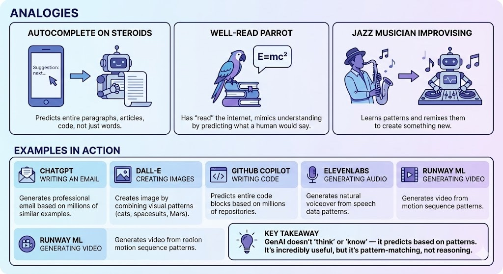

---

## 2. Regular AI vs. Generative AI

**One-sentence difference:** Regular AI finds, sorts, or decides — Generative AI creates something new.

### The Core Difference

| Regular AI | Generative AI |
|------------|---------------|
| Finds existing answers | Creates new content |
| Chooses from what exists | Makes something that never existed |
| "Here's what I found" | "Here's what I made" |

### Analogy: Library vs. Author

**Regular AI is like a librarian.** You ask a question, they search the shelves, and hand you a book that already exists. They're great at finding, organizing, and recommending — but they don't write new books.

**Generative AI is like an author.** You give them a topic, and they write a brand new book that never existed before. It might be inspired by books they've read, but the output is original.

### Examples Side-by-Side

| Task | Regular AI Does This | Generative AI Does This |
|------|---------------------|-------------------------|
| Search | Google finds existing webpages | ChatGPT writes a new answer |
| Images | Google Images finds existing photos | DALL-E creates a new image |
| Music | Spotify recommends existing songs | Suno creates a new song |
| Shopping | Amazon recommends products you might like | AI designs a new product |
| Email | Spam filter sorts into spam/not spam | AI writes a new email for you |
| Driving | Tesla decides: brake or accelerate | — (not a generation task) |

### Simple Diagram
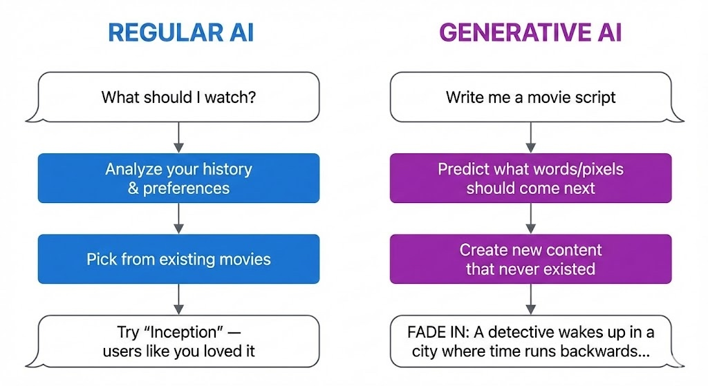


### Types of Regular AI (Non-Generative)

| Type | What It Does | Example |
|------|--------------|---------|
| Classification | Sorts things into categories | Email → Spam or Not Spam |
| Recommendation | Suggests existing items | "You might also like..." |
| Prediction | Forecasts outcomes | "80% chance of rain tomorrow" |
| Detection | Finds patterns/anomalies | Fraud detection on credit cards |
| Recognition | Identifies things | Face unlock on your phone |

*None of these create — they all analyze, sort, or choose.*

### Why This Matters

**Regular AI:** Great for automation, decisions, and finding things. Been around for decades.

**Generative AI:** New capability (mainstream since ~2022). Creates text, images, code, audio, video. This is the "ChatGPT revolution."

**The key thing to remember is...**

Regular AI = **Picker** (chooses from what exists)
Generative AI = **Maker** (creates something new)

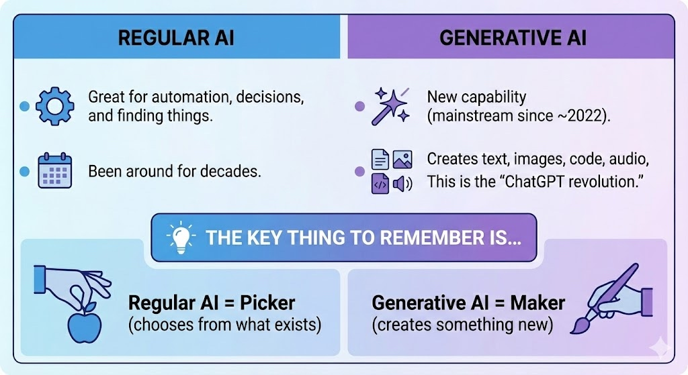

*Both are AI. Generative AI is just a specific type that focuses on creation rather than selection.*

---

## 3. Inside the Black Box: How Generative AI Works (Concise)

**One-liner:** GenAI predicts the most likely next word, over and over, based on patterns learned from billions of examples.

### The 5 Stages

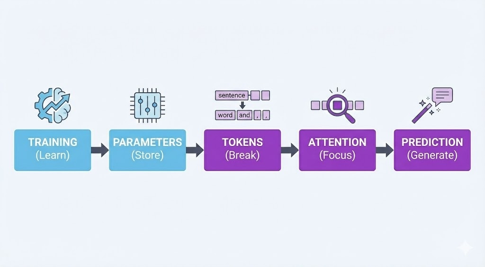


### Stage 1: Training

**What:** AI reads billions of webpages/books and learns patterns, not facts.

**Analogy:** A student who reads every library book but memorizes how sentences flow, not specific facts.

```
Sees: "Capital of France is Paris" / "Capital of Japan is Tokyo"
Learns: "Capital of [country] is [city]" pattern
```


### Stage 2: Parameters

**What:** Patterns stored as billions of numbers (weights).

**Analogy:** Like muscle memory — you can't explain how you ride a bike, but your body "knows."

| Model | Parameters |
|-------|------------|
| GPT-2 | 1.5B |
| GPT-4 | ~1.8T |


### Stage 3: Tokens

**What:** Text broken into chunks (usually word pieces).

**Analogy:** Lego bricks — smaller pieces AI can mix and match.

```
"Explain photosynthesis" → ["Explain", " photo", "synth", "esis"]
```

**Why it matters:** Context window, API cost, and speed all measured in tokens.


### Stage 4: Attention

**What:** AI decides which tokens matter most for the answer.

**Analogy:** Highlighting key words in a sentence.

```
"The Eiffel Tower, built in 1889, is in which city?"
       ▲ HIGH ATTENTION                    ▲ HIGH ATTENTION
```

*This is the "T" in GPT — Transformer — the breakthrough that lets AI see all words at once.*


### Stage 5: Prediction

**What:** Predict next token → add it → repeat thousands of times.

**Analogy:** Super-autocomplete.

```
"Best language for beginners is" →
   Python (42%) | JavaScript (18%) | Scratch (12%)...
   → Picks "Python" → Repeats for next word
```


### Temperature (Creativity Dial)

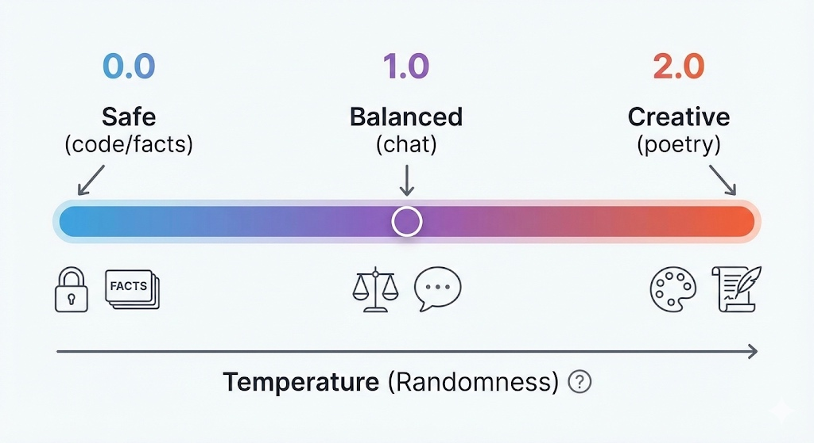


### Common Myths

| Myth | Reality |
|------|---------|
| "AI understands" | It predicts likely responses |
| "AI has a fact database" | Knowledge = compressed patterns |
| "AI remembers our chat" | Re-reads entire history each time |


### Cheat Sheet

| Component | One-liner |
|-----------|-----------|
| **Training** | Learn patterns from data |
| **Parameters** | Store patterns as numbers |
| **Tokens** | Break text into chunks |
| **Attention** | Decide what's relevant |
| **Prediction** | Guess next token, repeat |
| **Temperature** | Safe ↔ Creative dial |

**Key takeaway:** GenAI doesn't think — it asks "What word probably comes next?" thousands of times. That's the whole trick.


### Putting It All Together: A Complete Example

Here's what actually happens when you send a prompt to GenAI:

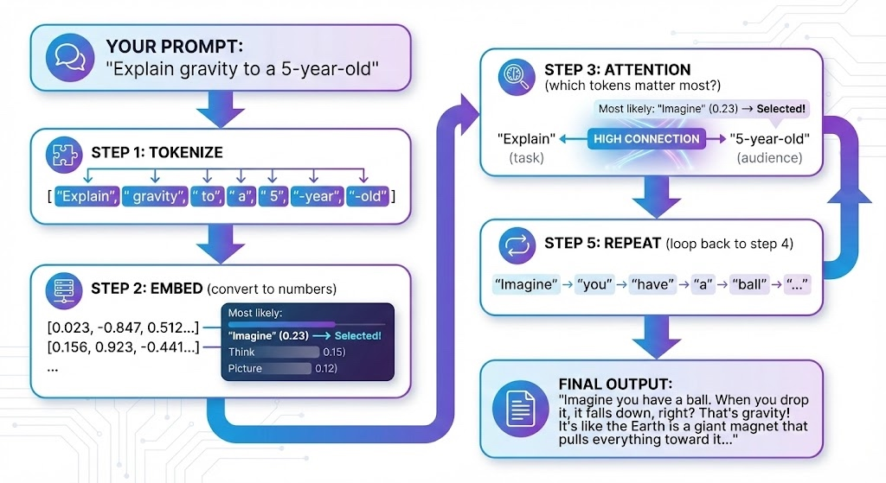

---

## 4. Types of AI Models: Foundational, Proprietary, Open Source

**One-liner:** Foundational models are the "engines" — proprietary means the company keeps the engine secret, open source means anyone can see and modify it. Products like Perplexity and Gamma are "cars" built using these engines.

### The Three Categories


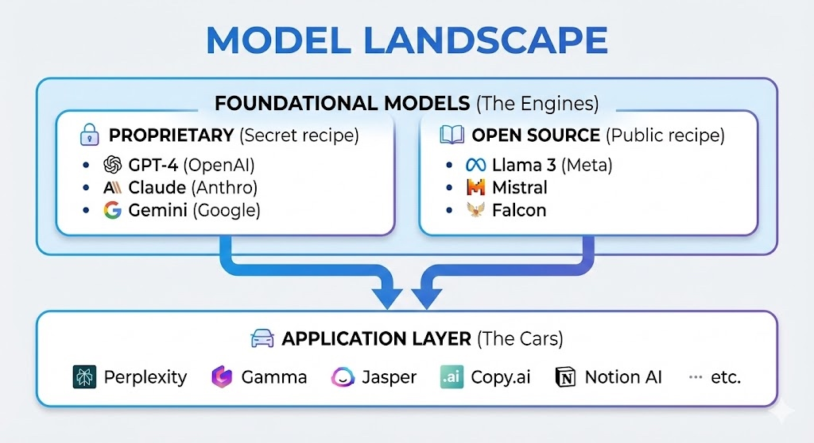

---

### 1. Foundational Models

**What:** Large pre-trained models that serve as the base "intelligence" — trained on massive data, general-purpose.

**Analogy:** The engine in a car. You don't build an engine from scratch to make a taxi service — you buy one and build around it.

| Characteristic | Description |
|---------------|-------------|
| **Training cost** | $10M - $100M+ |
| **Data** | Trillions of tokens |
| **Purpose** | General-purpose base to build on |
| **Who builds** | Big tech companies |


### 2. Proprietary Models (Closed Source)

**What:** Foundational models where the weights, training data, and code are kept secret. Access via API only.

**Analogy:** Coca-Cola's secret recipe — you can buy the drink, but you can't see how it's made.

| Model | Company | Access |
|-------|---------|--------|
| GPT-4, GPT-4o | OpenAI | API only |
| Claude 3.5/4 | Anthropic | API only |
| Gemini | Google | API only |

**Pros:** Often highest performance, managed infrastructure
**Cons:** No customization, vendor lock-in, data privacy concerns


### 3. Open Source Models

**What:** Foundational models where weights (and sometimes code/data) are publicly available. Download and run yourself.

**Analogy:** A recipe posted online — you can make it at home, modify it, sell your version.

| Model | Company | Parameters |
|-------|---------|------------|
| Llama 3.1 | Meta | 8B - 405B |
| Mistral | Mistral AI | 7B - 8x22B |
| Falcon | TII | 7B - 180B |
| Gemma | Google | 2B - 27B |

**Pros:** Free, customizable, data stays private, no API costs
**Cons:** Need infrastructure, often slightly lower performance


### Where Products Fit: The Application Layer

These companies don't build foundational models — they build products ON TOP of them:

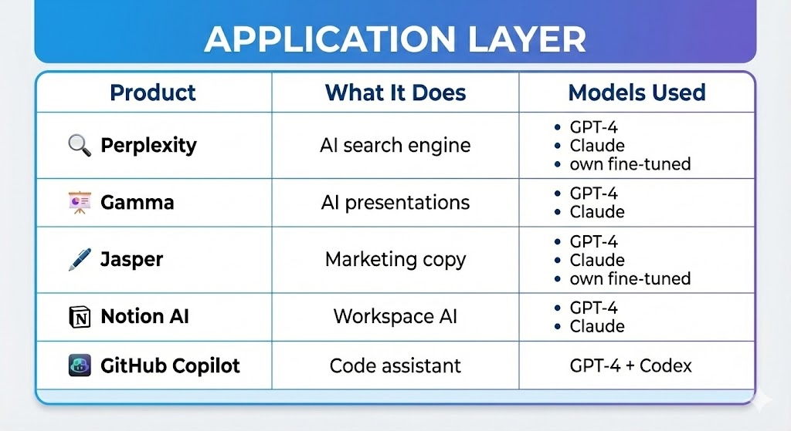


**Analogy:**

| Layer | Car Analogy | AI Example |
|-------|-------------|------------|
| Foundational Model | Engine (Toyota, Ford) | GPT-4, Llama, Claude |
| Application | Car brand (Uber, Lyft) | Perplexity, Gamma |
| End User | Passenger | You |

*Uber doesn't manufacture engines — they build a service using cars with existing engines. Same with Perplexity using GPT-4.*


### Quick Comparison

| Aspect | Proprietary | Open Source | App Layer |
|--------|-------------|-------------|-----------|
| **Example** | GPT-4, Claude | Llama, Mistral | Perplexity, Gamma |
| **Cost to use** | Pay per API call | Free (but need hardware) | Subscription |
| **Customization** | Limited | Full control | Use as-is |
| **Data privacy** | Sent to provider | Stays with you | Sent to provider |
| **Best for** | Quick start, best performance | Privacy, cost control, customization | Non-technical users |


### Visual: Who Builds What

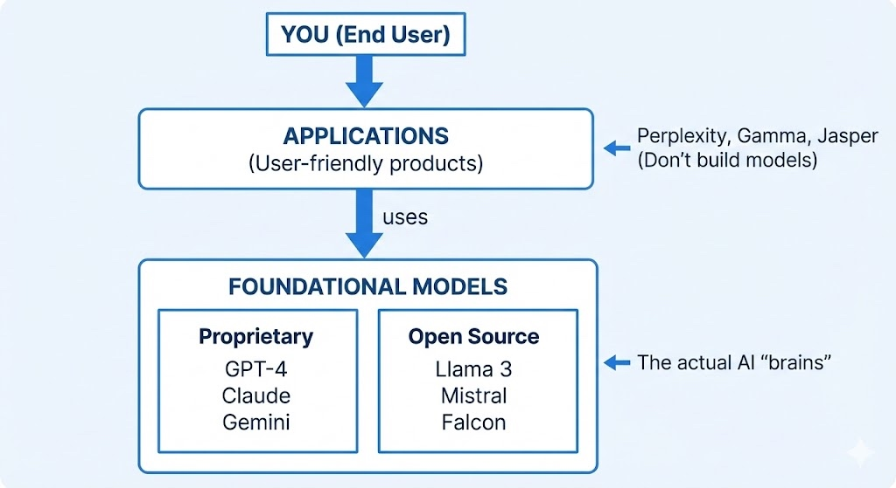


### Cheat Sheet

| Term | One-liner |
|------|-----------|
| **Foundational** | The base AI "engine" trained on massive data |
| **Proprietary** | Secret recipe — access via API only |
| **Open Source** | Public recipe — download and modify freely |
| **Application** | Products built ON TOP of foundational models |
| **Perplexity** | Search app using GPT-4/Claude underneath |
| **Gamma** | Presentation app using GPT-4/Claude underneath |

**Key takeaway:** Foundational models are the engines (GPT-4, Llama). Proprietary = secret engine, Open source = public engine. Apps like Perplexity and Gamma are cars built using those engines — they add a nice interface but don't build the AI themselves.

---

## 5. The Three Critical Limitations

**GenAI has three major weaknesses:** it can make things up (hallucinations), its knowledge has a cutoff date, and it can only "remember" a limited conversation.

### Limitation 1: Hallucinations

**It's like a confident friend who never admits they don't know something.** Instead of saying "I don't know," GenAI will confidently make up an answer that sounds completely plausible but is totally wrong.

**Examples:**
- Citing research papers that don't exist
- Inventing historical facts with specific (fake) dates
- Creating fake statistics that sound believable

### Limitation 2: Knowledge Cutoff

**It's like talking to someone who's been in a coma since a certain date.** GenAI was trained on data up to a specific point. It has no idea what happened after that — no recent news, no new discoveries, no current events.

**Example:** If the cutoff is January 2024, asking "Who won the 2024 Super Bowl?" will get you a guess, not a fact.

### Limitation 3: Context Window (Memory Limits)

**It's like talking to someone with short-term memory loss.** GenAI can only "remember" a certain amount of your conversation. Share a 100-page document? It might forget the beginning by the time it reaches the end.

```
Conversation Start ←————————————————→ Context Limit
   [Remembers this clearly]              [Starts forgetting]
```

**The key thing to remember is...** Always verify important facts, check if information might be outdated, and break long documents into smaller chunks.

---

## 6. VERIFY Framework (Using AI Responsibly)

**One-sentence definition:** VERIFY is a 6-step checklist to make sure you're using AI safely and getting accurate results.

### The Framework

| Letter | Meaning | It's Like... |
|--------|---------|--------------|
| **V** | Validate outputs against trusted sources | Double-checking Wikipedia with textbooks |
| **E** | Exclude sensitive data from prompts | Not sharing passwords on social media |
| **R** | Review for bias and accuracy | Getting a second opinion from a friend |
| **I** | Iterate prompts to improve results | Asking follow-up questions until you understand |
| **F** | Flag uncertainty in AI responses | Putting a "?" next to anything you're not sure about |
| **Y** | Your judgment is final | You're the driver, AI is just GPS |

### Analogy

**VERIFY is like being a newspaper fact-checker.** Journalists don't publish the first thing a source tells them. They verify with multiple sources, remove sensitive info, check for bias, ask follow-up questions, note uncertainties, and ultimately make the final call on what to publish.

**The key thing to remember is...** AI is a powerful assistant, but you're responsible for the final output. Always verify before trusting.

---

## 7. CRAFT Prompting Framework

**One-sentence definition:** CRAFT is a 5-part recipe for writing prompts that get much better AI results — like giving GPS not just a destination but also your preferred route, arrival time, and what to avoid.

### The Framework

```
C - Context    → "Here's the background situation..."
R - Role       → "Act as a [expert type]..."
A - Ask        → "Please do this specific task..."
F - Format     → "Present it as a [table/list/email]..."
T - Tone       → "Use a [professional/casual] voice..."
```

### Analogy

**It's like ordering at a restaurant vs. telling the chef exactly what you want.**

| Vague Order (Bad Prompt) | CRAFT Order (Good Prompt) |
|--------------------------|---------------------------|
| "Give me food" | **C:** "I'm gluten-free and allergic to nuts" |
| | **R:** "You're a nutritionist-chef" |
| | **A:** "Make me a protein-rich dinner" |
| | **F:** "Main dish + 2 sides" |
| | **T:** "Comfort food style" |

### Example Transformation

**Bad prompt:** "Write about our product"

**CRAFT prompt:**
- **C:** "We're launching a project management app for freelancers next month"
- **R:** "Act as a B2B SaaS copywriter"
- **A:** "Write 3 email subject lines for our launch announcement"
- **F:** "Format as numbered list with 5-7 word subjects"
- **T:** "Professional but friendly, avoid corporate jargon"

**The key thing to remember is...** More specific instructions = more useful outputs. Spend 2 minutes on your prompt to save 20 minutes on revisions.

---

## 8. Four Prompting Techniques

**One-sentence definition:** These are four power-ups you can add to any prompt to dramatically improve the results.

### Technique 1: Few-Shot Prompting

**It's like teaching by example.** Instead of just explaining what you want, you *show* the AI 2-3 examples of good outputs, then ask for more like those.

```
"Here are examples of good customer responses:

Example 1: 'Thanks for reaching out! I'll look into this today.'
Example 2: 'Great question! Here's what I found...'

Now write 5 more responses in this style for billing questions."
```

### Technique 2: Iterative Refinement

**It's like sculpting clay.** Start with a rough draft, then keep shaping it with follow-up requests: "Make it shorter," "Add more humor," "Focus on section 2."

```
First prompt:  "Write a product description"
Iteration 1:   "Make it half the length"
Iteration 2:   "Add a customer testimonial"
Iteration 3:   "Make the opening more exciting"
```

### Technique 3: Output Formatting

**It's like asking for the same story in different containers.** Same information, but structured as a table, bullet points, JSON, email, or whatever format you need.

```
"Present this information as:
- A 3-column table (Feature | Benefit | Priority)
- A bullet-point summary
- A customer-facing FAQ"
```

### Technique 4: Self-Critique

**It's like asking AI to be its own editor.** Ask the AI to review its own work and fix the problems it finds.

```
"Review your response above. Identify 3 weaknesses or gaps, then rewrite it addressing those issues."
```

### Quick Reference

| Technique | When to Use | Magic Words |
|-----------|-------------|-------------|
| Few-shot | Need consistent style | "Here are examples... now create more like these" |
| Iterative | First draft isn't right | "Make it [shorter/longer/friendlier]" |
| Formatting | Need specific structure | "Present as a [table/list/email]" |
| Self-critique | Want higher quality | "Review and identify 3 weaknesses, then fix them" |

**The key thing to remember is...** Don't settle for the first output. These techniques turn good results into great results.


---

## 9. Advanced Prompting: Meta-Prompting & COSTAR

**One-sentence definition:** Instead of writing prompts yourself, use advanced frameworks like meta-prompting (asking AI to write the prompt) or COSTAR (structured 6-part prompts) for world-class results.

---

### Meta Prompting

**What it is:** A higher-level technique where you ask the AI to write the prompt for you instead of writing the final instruction yourself.

**How it works:**

```
"I want to [practice a technical interview for a Senior Python Developer role at Google].

Act as an expert Prompt Engineer. Please write the best possible prompt that I can use
to get a world-class response from you.

Include any necessary context, role-playing personas, or constraints that will make the
output high-quality."
```

**When to use:** When you're unsure how to structure a complex request, or when you want the AI to help you craft the perfect prompt before executing the task.

---

### COSTAR Framework

**What it is:** COSTAR is a prompt engineering framework used to structure instructions for Large Language Models (LLMs) like GPT-4 or Claude. Instead of asking a vague question, you break your request into six specific components to ensure the AI understands exactly what you need.

**It stands for:**

- **C** - Context (Background information)
- **O** - Objective (The specific task)
- **S** - Style (Writing style or persona)
- **T** - Tone (Emotional attitude)
- **A** - Audience (Who is reading this?)
- **R** - Response (Format of the output)

---

### Example: Writing a Rejection Email

**Without COSTAR (Bad):**

```
"Write a rejection email to a candidate."
```

**With COSTAR (Good):**

**Context:** I am a hiring manager at a tech startup. We interviewed a junior developer named Alex who was great culturally but lacked the necessary Python experience.

**Objective:** Write a rejection email that encourages them to apply again in 6 months after learning more Python.

**Style:** Professional but human, like a mentor speaking to a student.

**Tone:** Empathetic and encouraging, not cold or corporate.

**Audience:** A young college graduate who is eager to learn.

**Response:** Format as a plain text email body, ready to copy-paste.

**Why the COSTAR version wins:** The AI knows why the candidate was rejected (Context), specific advice to give (Objective), and that it shouldn't sound like a robot (Tone/Style).

---

### When to Use Meta-Prompt vs COSTAR Framework

**Here's how to decide which strategy to use:**

**Scenario A: I need a specific deliverable** (e.g., A JSON object, a SQL query, or a cold email)
→ **Use COSTAR** — You know what you want, you just need to structure the request clearly.

**Scenario B: I'm not sure how to structure my request**
→ **Use Meta-Prompting** — Let the AI help you design the perfect prompt first, then execute it.

---


## 10. Advanced Prompt Engineering Techniques (Deep Dive)

This section provides a comprehensive exploration of 12 prompt engineering techniques with practical examples, use cases, and when to apply each one.

### 1. Zero-Shot Prompting

**When to Use:**
- Simple, well-defined tasks
- LLM has strong prior knowledge of the domain
- No examples available yet
- Quick prototyping or testing

**When NOT to Use:**
- Complex formatting requirements
- Domain-specific jargon or style
- Tasks requiring specific output structure
- Ambiguous instructions where examples would clarify

**Structure:**
```
[Clear instruction] + [Task details] + [Output format]
```

**Bad Example:**
```
Write something about Python error handling.
```
*Problem: Vague scope, no format, no specific angle*

**Good Example:**
```
Explain Python's try-except-finally block in 3 sentences.
Include one code snippet showing proper exception handling.
Target audience: intermediate developers.
```
*Why: Specific scope, format, length, and audience defined*

---

### 2. Few-Shot Prompting

**When to Use:**
- Specific formatting needed (JSON, tables, templates)
- Style matching required
- Classification tasks
- Pattern recognition needed
- Domain-specific transformations

**When NOT to Use:**
- LLM already understands the format
- Examples are inconsistent or conflicting
- Task is self-explanatory
- Limited context window (examples consume tokens)

**Structure:**
```
[Task description]

Example 1:
Input: [example input]
Output: [example output]

Example 2:
Input: [example input]
Output: [example output]

Now apply to:
Input: [actual input]
Output:
```

**Bad Example:**
```
Convert to JSON:
Name: John, Age: 30
Name: Sarah, Age: 25

Convert: Name: Mike, Age: 40
```
*Problem: Inconsistent formatting, no field definitions*

**Good Example:**
```
Extract structured data from user messages:

Example 1:
Input: "I need a flight to NYC on Dec 15th"
Output: {"type": "flight", "destination": "NYC", "date": "2024-12-15"}

Example 2:
Input: "Book hotel in Paris for 3 nights starting Jan 5"
Output: {"type": "hotel", "location": "Paris", "duration": "3 nights", "start_date": "2025-01-05"}

Extract from: "Reserve rental car in Miami from Feb 10-12"
Output:
```
*Why: Consistent structure, clear field mapping, diverse examples*

---

### 3. Chain-of-Thought (CoT)

**When to Use:**
- Multi-step reasoning required
- Mathematical or logical problems
- Complex decision-making
- Debugging or analysis tasks
- Need to verify reasoning path

**When NOT to Use:**
- Simple retrieval or lookup tasks
- When only final answer matters (tokens are precious)
- Real-time/low-latency requirements
- Creative writing (can make it mechanical)

**Structure:**
```
[Task] + "Think step-by-step" OR "Show your reasoning before answering"
```

**Bad Example:**
```
Calculate the ROI of our marketing campaign. Think step-by-step.
```
*Problem: Missing data, unclear what steps to show*

**Good Example:**
```
Calculate marketing ROI with this data:
- Campaign cost: $10,000
- Revenue generated: $45,000
- Attribution: 60% direct, 40% assisted

Think step-by-step:
1. Calculate attributed revenue
2. Subtract campaign cost
3. Compute ROI percentage
4. Explain if this meets our 3x ROI target
```
*Why: Data provided, specific steps outlined, clear success criteria*

---

### 4. ReAct (Reasoning + Acting)

**When to Use:**
- Multi-tool workflows (search → analyze → generate)
- Agent-based systems
- Tasks requiring external information
- Dynamic decision-making (if X then Y)
- N8N workflows with branching logic

**When NOT to Use:**
- Single-step tasks
- No external tools available
- Linear workflows (use prompt chaining instead)
- When reasoning overhead isn't needed

**Structure:**
```
Task: [goal]
Available tools: [list]

For each step:
Thought: [reasoning]
Action: [tool_name(parameters)]
Observation: [result]
... (repeat until)
Answer: [final response]
```

**Bad Example:**
```
Search for Python tutorials and summarize them.
Tools: web_search
```
*Problem: No reasoning structure, unclear iteration*

**Good Example:**
```
Find the latest Python 3.12 async features and create a code example.

Available tools: web_search(query), web_fetch(url)

Thought: I need recent documentation about Python 3.12 async features
Action: web_search("Python 3.12 async new features")
Observation: [results show TaskGroups and asyncio improvements]

Thought: Need official documentation for accuracy
Action: web_fetch("https://docs.python.org/3.12/whatsnew/3.12.html")
Observation: [full docs retrieved]

Thought: Now I can create accurate example
Answer: [code example with TaskGroups]
```
*Why: Clear thought → action → observation loop, explicit reasoning*

---

### 5. Role-Based Prompting

**When to Use:**
- Domain expertise needed (legal, medical, technical)
- Specific perspective required
- Tone/style customization
- Technical documentation
- Code review or architecture decisions

**When NOT to Use:**
- Generic tasks where role doesn't add value
- Over-specification that constrains creativity
- When expertise might introduce bias

**Structure:**
```
You are a [specific role with expertise].
Your task is [goal].
Approach this as [persona] would, focusing on [domain aspects].
```

**Bad Example:**
```
You are an expert. Write Python code for data processing.
```
*Problem: Vague expertise, no specific domain knowledge leveraged*

**Good Example:**
```
You are a senior data engineer specializing in real-time ETL pipelines using Python, Apache Kafka, and AWS.

Review this data ingestion code for:
- Scalability issues (target: 10K events/sec)
- Error handling in streaming contexts
- Memory leaks in long-running processes
- Best practices for backpressure handling

[code here]
```
*Why: Specific expertise, measurable criteria, domain context*

---

### 6. Prompt Chaining

**When to Use:**
- Complex workflows (RAG pipelines)
- Quality > speed
- Each step needs different specialization
- Intermediate outputs need validation
- N8N automation sequences

**When NOT to Use:**
- Simple single-step tasks
- Real-time requirements
- Limited API calls budget
- When outputs don't build on each other

**Structure:**
```
Prompt 1: [specialized task A] → Output A
Prompt 2: Use Output A to [specialized task B] → Output B
Prompt 3: Use Output B to [final task] → Final Output
```

**Bad Example:**
```
Chain:
1. Summarize this article
2. Make it better
3. Add hashtags
```
*Problem: Vague objectives, no clear specialization per step*

**Good Example:**
```
CHAIN 1 - Query Rewriting:
User query: "python async stuff"
Rewrite as 3 specific search queries optimized for technical documentation.
Output: {{search_queries}}

CHAIN 2 - Retrieval Ranking:
Retrieved docs: {{retrieved_chunks}}
Rank by relevance to: {{search_queries}}
Return top 5 with confidence scores.
Output: {{ranked_docs}}

CHAIN 3 - Synthesis:
Context: {{ranked_docs}}
Original query: "python async stuff"
Generate answer with:
- Code examples
- Citations (doc IDs)
- Confidence score (0-1)
Output format: JSON
```
*Why: Each step has clear input/output, specialization, structured flow*

---

### 7. Constraint-Based Prompting

**When to Use:**
- Need to prevent specific behaviors
- Format compliance (legal, regulatory)
- Brand guidelines enforcement
- API response requirements
- Content moderation

**When NOT to Use:**
- Over-constraining kills creativity
- Constraints conflict with each other
- Simple tasks where flexibility is fine

**Structure:**
```
[Task]

MUST include: [requirements]
MUST NOT include: [prohibitions]
Format: [structure]
Length: [bounds]
```

**Bad Example:**
```
Write a blog post. Keep it professional.
```
*Problem: "Professional" is subjective, no measurable constraints*

**Good Example:**
```
Write a product description for enterprise RAG platform.

MUST include:
- One quantified benefit (e.g., "40% faster retrieval")
- One integration mention (Pinecone, Weaviate, or ChromaDB)
- Use case example from finance OR healthcare

MUST NOT include:
- Marketing fluff ("revolutionary", "game-changing")
- Unverified claims
- Technical jargon not explained
- More than 150 words

Format: 3 paragraphs with subheadings
Tone: Technical but accessible
```
*Why: Specific inclusions/exclusions, measurable limits, clear structure*

---

### 8. Self-Consistency Sampling

**When to Use:**
- High-stakes decisions (medical, legal, financial)
- Ambiguous problems with multiple valid approaches
- Need confidence estimation
- Quality > cost

**When NOT to Use:**
- Deterministic tasks (formatting, data extraction)
- Budget constraints (requires multiple API calls)
- Real-time systems
- Tasks with single correct answer

**Structure:**
```
Generate N different reasoning paths for:
[problem]

Compare answers and:
1. Identify consensus answer
2. Note divergent reasoning
3. Provide confidence score based on agreement
```

**Bad Example:**
```
Give me 3 answers to: What's the capital of France?
```
*Problem: Deterministic question, no value in multiple samples*

**Good Example:**
```
A startup has $500K funding and two options:
Option A: Hire 5 engineers ($400K/year) + minimal marketing
Option B: Hire 2 engineers ($160K/year) + $200K marketing + freelancers

Generate 3 independent analyses considering:
- 18-month runway
- B2B SaaS product (0 revenue currently)
- Technical complexity requires strong team

For each analysis:
1. Compute runway for each option
2. Assess risk factors
3. Recommend option

Then: Compare recommendations and explain consensus or disagreement.
```
*Why: Ambiguous problem, multiple valid approaches, genuine uncertainty*

---

### 9. Meta-Prompting (Prompt Generation)

**When to Use:**
- Building prompt templates for non-technical users
- Creating N8N workflow prompt libraries
- A/B testing prompt variations
- Teaching prompt engineering

**When NOT to Use:**
- Direct task execution (just do the task instead)
- Over-engineering simple prompts
- When you already have proven prompts

**Structure:**
```
Generate a prompt for [use case] that:
- Handles [input type]
- Produces [output format]
- Includes [specific constraints]
- Uses [technique name] technique

Provide 3 variations: basic, intermediate, advanced.
```

**Bad Example:**
```
Make me a prompt for summarizing.
```
*Problem: No specifications, no use case context*

**Good Example:**
```
Generate a prompt template for N8N workflow that:

Use case: Summarize customer support tickets
Input: {{ticket_text}} (variable length, 50-500 words)
Output: JSON with keys: {summary, sentiment, priority, suggested_action}

Requirements:
- Use few-shot learning with 2 examples
- Include constraint: summary max 50 words
- Add instruction for extracting action items
- Specify priority scale: low/medium/high/urgent

Provide:
1. The complete prompt template
2. Example with sample ticket
3. Expected output for the example
```
*Why: Complete specifications, structured deliverable, actionable template*

---

### 10. Negative Prompting

**When to Use:**
- Preventing known unwanted patterns
- Removing verbose AI behaviors (apologies, disclaimers)
- Content filtering
- Style refinement

**When NOT to Use:**
- Over-constraining creative tasks
- When positive instructions are clearer
- Adding too many negatives (confusing)

**Structure:**
```
[Task]

DO NOT:
- [behavior 1]
- [behavior 2]
- [behavior 3]
```

**Bad Example:**
```
Write code. Don't make mistakes.
```
*Problem: "Mistakes" is too vague*

**Good Example:**
```
Generate Python function for API rate limiting.

DO NOT:
- Include apologies or explanatory preamble
- Use time.sleep() (use asyncio instead)
- Add print statements (use logging module)
- Write comments explaining obvious code
- Include error handling for network issues (caller handles this)

DO:
- Use decorator pattern
- Include type hints
- Return remaining quota in response
```
*Why: Specific behaviors prevented, balanced with positive instructions*

---

### 11. Output Structuring

**When to Use:**
- API integrations (N8N, Zapier)
- Data parsing requirements
- Multi-field extraction
- Downstream processing in pipelines

**When NOT to Use:**
- Human-only consumption (prose is fine)
- Format complexity exceeds task value
- LLM struggles with strict JSON (use XML instead)

**Structure:**
```
[Task]

Return ONLY valid JSON with this exact structure:
{
  "field1": "type",
  "field2": ["array", "of", "items"],
  "nested": {
    "field3": "value"
  }
}

No markdown code blocks, no explanations, pure JSON only.
```

**Bad Example:**
```
Extract info from this email and give me JSON:
[email content]
```
*Problem: No schema defined, "info" is ambiguous*

**Good Example:**
```
Extract meeting details from email:

[email: "Let's meet Tuesday at 2pm at Coffee Shop on Main St to discuss Q4 budget"]

Return ONLY this JSON structure (no markdown, no explanations):
{
  "meeting_date": "YYYY-MM-DD or null if not specific",
  "meeting_time": "HH:MM or null",
  "location": "string or null",
  "attendees": ["array of names mentioned"],
  "topics": ["array of discussion topics"],
  "action_items": ["array or empty"],
  "confidence": 0.0-1.0
}

If any field cannot be determined, use null. Always include confidence score.
```
*Why: Exact schema, data types, null handling, parsing rules clear*

---

### 12. Iterative Refinement Prompting

**When to Use:**
- Complex deliverables (reports, documentation)
- Collaborative AI workflows
- Learning user preferences
- Quality improvement cycles

**When NOT to Use:**
- Simple one-shot tasks
- Stateless API calls (no conversation memory)
- Time-sensitive requests

**Structure:**
```
Iteration 1: Generate [draft]
Iteration 2: Critique your output for [criteria]
Iteration 3: Revise based on critique
```

**Bad Example:**
```
Write an article. Then make it better.
```
*Problem: "Better" undefined, no critique criteria*

**Good Example:**
```
Task: Create RAG system architecture diagram description

Iteration 1: Write technical description of components
Iteration 2: Self-critique against these criteria:
- Are all data flows explained?
- Is latency at each stage mentioned?
- Are error handling paths covered?
- Would a senior engineer spot gaps?

Iteration 3: Revise description addressing each critique point

Iteration 4: Add one-paragraph "Scaling Considerations" section
```
*Why: Specific improvement criteria, staged refinement, measurable progress*

---

### Quick Reference Matrix

| Technique | Complexity | Token Cost | Best For | Avoid For |
|-----------|-----------|------------|----------|-----------|
| Zero-Shot | Low | Low | Simple tasks | Complex formatting |
| Few-Shot | Medium | Medium | Pattern matching | Self-explanatory tasks |
| CoT | Medium | High | Multi-step reasoning | Simple lookups |
| ReAct | High | High | Agent workflows | Linear tasks |
| Role-Based | Low | Low | Domain expertise | Generic tasks |
| Chaining | High | High | RAG pipelines | Single-step tasks |
| Constraints | Low | Low | Compliance | Creative tasks |
| Self-Consistency | High | Very High | High-stakes decisions | Deterministic tasks |
| Meta-Prompting | Medium | Medium | Template building | Direct execution |
| Negative | Low | Low | Behavior prevention | Positive alternatives exist |
| Output Structuring | Medium | Low | API integration | Human-only reading |
| Iterative | High | High | Quality refinement | One-shot needs |

---

### Combining Techniques (Advanced)

**RAG Pipeline Example:**
```
1. Few-Shot + Output Structuring: Query rewriting
2. Constraint-Based: Filter retrieval results
3. CoT: Rank documents by relevance
4. Role-Based + Negative: Generate answer (expert tone, no disclaimers)
5. Output Structuring: Format as JSON with citations
```

This combination creates a production-ready RAG response in a structured, repeatable way.

---

### Practice Exercise

**Build a RAG pipeline prompt that:**
1. Rewrites user query for better retrieval
2. Ranks retrieved chunks by relevance
3. Synthesizes answer with citations
4. Returns JSON with confidence score

**Solution Framework:**

```
# Step 1: Query Rewriting (Few-Shot + Output Structuring)
Original query: {{user_query}}

Rewrite into 3 optimized search queries:
Example: "python async" → ["python asyncio library", "async await python syntax", "python asynchronous programming tutorial"]

Output: ["query1", "query2", "query3"]

# Step 2: Ranking (CoT + Role-Based)
You are a search relevance engineer.

Retrieved chunks: {{chunks}}
Queries: {{rewritten_queries}}

Think step-by-step:
1. Score each chunk against each query (0-1)
2. Calculate weighted average
3. Rank top 5 chunks

Output JSON: [{"chunk_id": "x", "score": 0.95, "reason": "..."}, ...]

# Step 3: Synthesis (Constraint-Based + Negative)
Context: {{top_chunks}}
Original query: {{user_query}}

Generate answer:
MUST include: Code examples, citations [1], [2]
MUST NOT: Apologize, use disclaimers, exceed 200 words

# Step 4: Final Output (Output Structuring)
Return ONLY this JSON:
{
  "answer": "string",
  "citations": [{"id": 1, "chunk_id": "x", "relevance": 0.95}],
  "confidence": 0.85,
  "suggested_followups": ["question1", "question2"]
}
```

---

### Key Takeaways

1. **Match technique to task complexity** - Don't over-engineer simple prompts
2. **Token costs matter** - CoT and chaining are expensive; use strategically
3. **Examples beat instructions** - Few-shot works when explanations fail
4. **Structure enables automation** - JSON output is essential for N8N workflows
5. **Combine techniques** - Real systems need 3-5 techniques working together
6. **Test iteratively** - Start simple, add complexity based on failures
7. **Document patterns** - Save successful prompts as templates

---

### Additional Resources

- **Anthropic Prompt Engineering Guide**: https://docs.claude.com/en/docs/build-with-claude/prompt-engineering/overview
- **N8N AI Documentation**: For workflow integration patterns
- **LangChain Prompts**: Template library for inspiration

---

*Prompt Engineering Techniques Guide - Version 1.0 - January 2026*


## 11. The Five AI Architectures

**There are 5 different ways** to build AI solutions, ranging from simple chat to fully autonomous AI teams — choosing the right one depends on your task complexity.

### The Spectrum

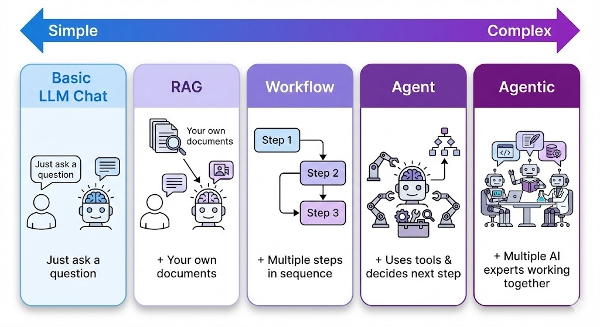


### Architecture 1: Basic LLM Chat

**Direct conversation:** with AI using only the knowledge it was trained on — like texting a very smart friend who has read a lot of books.

**It's like:** A walking encyclopedia you can have a conversation with. Great for general knowledge, but it hasn't read your company's documents or today's news.

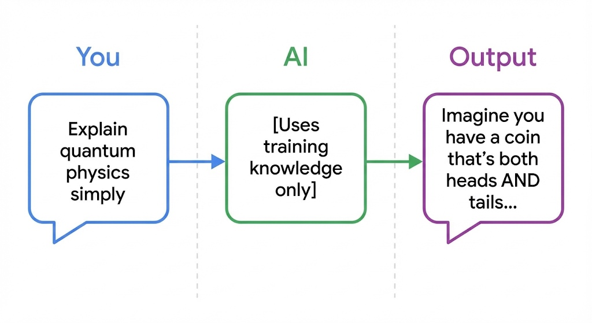

**Best for:** Brainstorming, drafting content, explaining concepts, quick questions where general knowledge is enough.

**Limitations:** Doesn't know your specific data, can hallucinate facts, knowledge cutoff.

**Examples:**
- "Help me brainstorm product names"
- "Explain machine learning to a 10-year-old"
- "Draft a thank-you email"


### Architecture 2: RAG (Retrieval-Augmented Generation)

**AI that first searches your documents:** to find relevant information, then generates answers based on what it found — like an assistant who checks your files before answering.

**It's like:** A librarian who searches the right books first, then answers your question using what they found. They quote real sources instead of guessing.

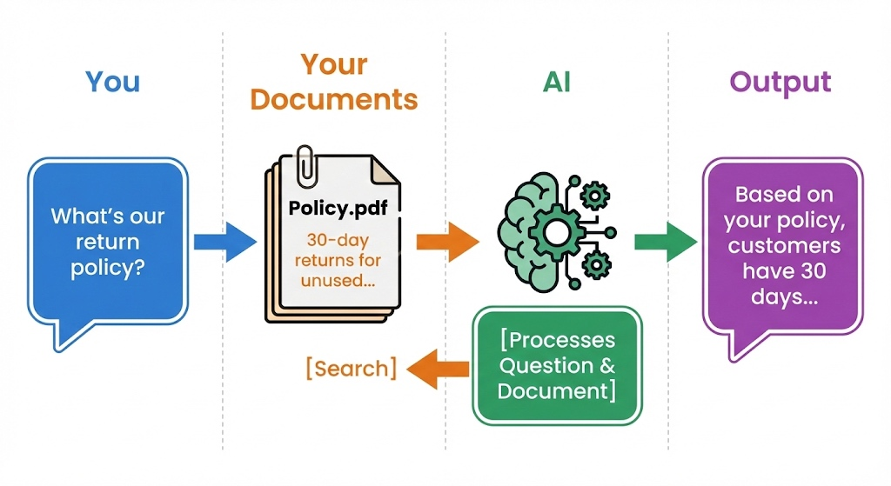

**Best for:** Q&A over company documents, customer support with accurate answers, research across large document collections.

**Key components explained simply:**

| Component | What It Does | Analogy |
|-----------|--------------|---------|
| Document Loader | Reads your files | Scanner at a library |
| Chunker | Splits docs into searchable pieces | Cutting a book into chapters |
| Embeddings | Converts text to searchable format | Creating an index |
| Vector Database | Stores and finds chunks | The library's card catalog |
| LLM | Writes the final answer | The librarian explaining what they found |

**The key thing to remember is...** RAG = AI that checks YOUR documents before answering, reducing hallucinations and giving sourced answers.


### Architecture 3: AI Workflow (Orchestrated Pipelines)

**Multiple AI steps chained together:** in a fixed sequence, where each step does one specific job — like a factory assembly line where AI handles certain stations.

**It's like:** A car assembly line. Step 1 adds the frame, Step 2 adds the engine, Step 3 paints it. Each step has one job, in a specific order, every time.

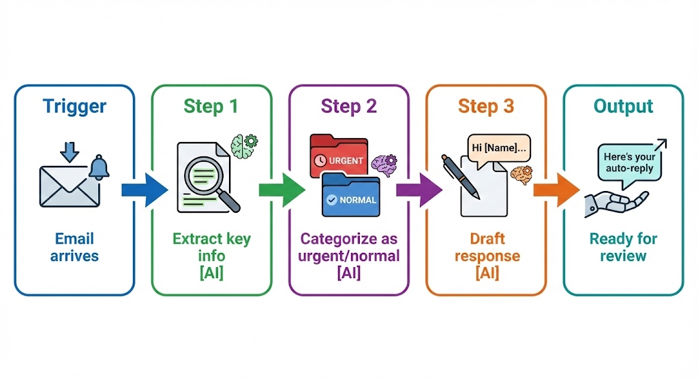
****
**Best for:** Repeatable processes, document processing, content pipelines where you know exactly what steps are needed.

**Key characteristics:**

| Aspect | Description |
|--------|-------------|
| Flow | Fixed path — same every time |
| Control | You design the steps |
| Reliability | High — predictable results |
| Flexibility | Low — can't adapt to surprises |

**Example workflows:**

**Weekly competitor monitor:**
```
Timer (weekly) → Fetch competitor website → Extract changes (AI) → 
Compare to last week (AI) → Format report → Send to Slack
```

**Cold Outreach:**
```
Timer (daily) → Get company names(AI) 
                 → Send Email Outreach emails (AI) 
```

**Tools:** N8N, Make, Zapier, Power Automate

**The key thing to remember is...** Workflows are for *predictable* multi-step processes where you know exactly what needs to happen in what order.


### Architecture 4: AI Agent

**AI that uses tools** and decides its own next steps to complete a task — like a expert software engineer who figures out what to do instead of being told every step.

**It's like:** Giving someone a goal ("research and book me a flight to Tokyo") instead of step-by-step instructions. They decide: Should I check prices first? Search multiple airlines? What dates work best? They use tools (websites, calendars) and adapt as they go.

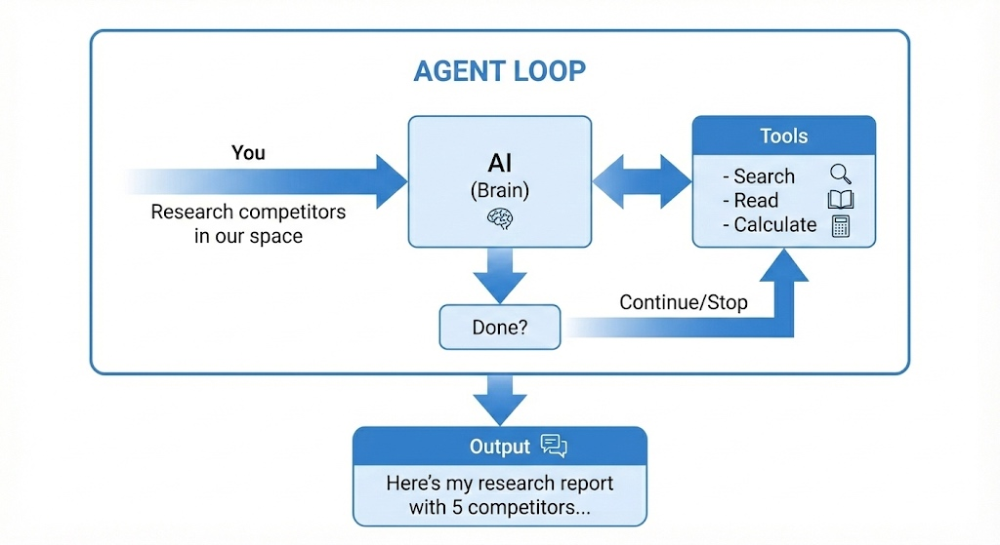

**Best for:** Research tasks, problems where you don't know the exact steps in advance, tasks requiring multiple tool uses.

**Key characteristics:**

| Aspect | Description |
|--------|-------------|
| Flow | Dynamic — AI chooses next step |
| Control | Goal-directed (you give the goal) |
| Reliability | Medium — can get stuck or loop |
| Flexibility | High — adapts to what it finds |

**Workflow vs. Agent:**

| Workflow | Agent |
|----------|-------|
| "Do step 1, then 2, then 3" | "Achieve this goal" |
| You plan the steps | AI plans the steps |
| Same path every time | Different path based on situation |
| Like a recipe | Like a personal assistant |

**The key thing to remember is...** Agents are for tasks where you know the *goal* but not the exact steps. You give them tools and let them figure it out.


### Architecture 5: Agentic AI (Multi-Agent Systems)

**Multiple specialized AI agents working together as a team**, each with different expertise, collaborating to tackle complex projects — like an AI company with different departments.

**It's like:** A film production crew. You have a director (orchestrator), writer (content agent), cinematographer (visual agent), and editor (review agent). Each is an expert in their role, they pass work to each other, and together they create something none could alone.

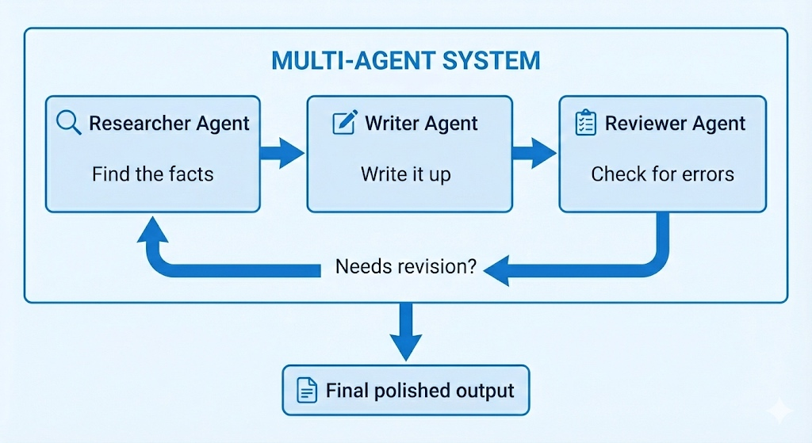

**Common team patterns:**

| Pattern | How It Works | Example |
|---------|--------------|---------|
| **Pipeline** | Agents work in sequence | Research → Write → Edit → Publish |
| **Supervisor** | One agent assigns tasks | Manager agent delegates to specialists |
| **Debate** | Agents argue different sides | Pro agent vs. Con agent for decisions |
| **Swarm** | Agents work in parallel | 5 researchers each tackle different sources |

**Best for:** Complex projects requiring multiple expertise areas, tasks benefiting from review/critique cycles, situations where quality matters more than speed.

**Example: Product Launch Team**

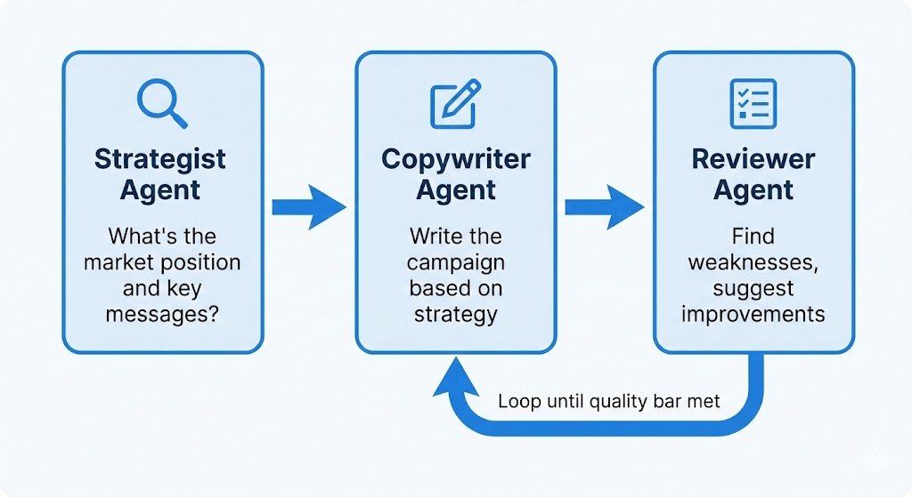


**The key thing to remember is...** Multi-agent systems are for complex work that benefits from specialized roles and built-in review cycles — like having an AI team instead of one AI assistant.

---

### Choosing the Right Architecture

Use this **decision tree** to pick the simplest architecture that solves your problem — don't use a construction crew when you need a handyman.

#### The Decision Flowchart

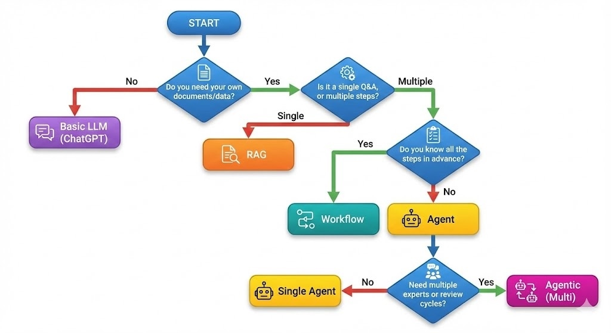

#### Quick Reference Table

| If Your Task Is... | Use This | Example |
|--------------------|----------|---------|
| General question, no custom data | Basic LLM | "Explain blockchain" |
| Q&A over your documents | RAG | "What does our policy say about..." |
| Same steps every time | Workflow | Weekly report automation |
| Dynamic, figure-it-out task | Agent | "Research and summarize topic X" |
| Complex project needing review | Agentic | Content creation with editing cycles |

**The key thing to remember is...** Start with the simplest option that works. You can always upgrade to a more complex architecture if needed.

---

# 12. AI Tools Directory

A curated list of popular AI tools across different categories — from conversational AI to creative content generation.

| Tool Name | What does it do? | Tool Link |
|-----------|-----------------|-----------|
| **Whispr Flow** | Converts speech to text in real time across apps. Helps users dictate, format, and edit content hands-free. | [Visit](https://outskill.link/wisprflow) |
| **Gemini** | Google's AI assistant integrated into Search and Workspace. Provides conversational, multimodal, and contextual help. | [Visit](https://outskill.link/gemini) |
| **Emily** | AI tool for engineers to scaffold, deploy, and manage ML or microservice projects. Simplifies orchestration and deployment. | [Visit](https://outskill.link/emily) |
| **Fireflies** | Records, transcribes, and summarizes meetings automatically. Integrates with Zoom, Meet, and Teams to extract insights. | [Visit](https://outskill.link/fireflies) |
| **ChatGPT** | OpenAI's conversational assistant that can chat, code, write, summarize, and brainstorm across domains. | [Visit](https://outskill.link/chatgpt) |
| **Claude** | Anthropic's AI model focused on safe, interpretable, and creative conversations with high contextual reasoning. | [Visit](https://outskill.link/claude) |
| **Phot AI** | AI-powered tool for editing, enhancing, and generating photos or visual content. Great for quick creative visuals. | [Visit](https://outskill.link/phot) |
| **Supergrow** | AI marketing platform to help grow leads, optimize campaigns, and accelerate audience engagement. | [Visit](https://outskill.link/supergrow) |
| **Perplexity** | AI search engine combining live web data and LLM reasoning to give factual, cited answers. | [Visit](https://outskill.link/perplexity) |
| **Writesonic** | AI content generation platform for blogs, ads, and marketing copy. Boosts productivity for writers and marketers. | [Visit](https://outskill.link/writesonic) |
| **Numerous AI** | A multi-purpose AI platform offering various automation and generation tools under one suite. | [Visit](https://outskill.link/numerous) |
| **Genspark** | Generates creative ideas, articles, and media using generative AI — a "spark" for inspiration. | [Visit](https://outskill.link/genspark) |
| **Suno** | AI music generator for composing songs, jingles, and soundscapes from text prompts. | [Visit](https://outskill.link/suno) |
| **Notebook LM** | Google's AI research assistant that summarizes, queries, and connects your notes and documents intelligently. | [Visit](https://outskill.link/notebook-lm) |
| **Social Sonic** | Helps create, schedule, and optimize social media content using AI-driven insights. | [Visit](https://outskill.link/socialsonic) |
| **Bolt** | Developer tool or automation assistant built for fast prototyping and deployment of apps or workflows. | [Visit](https://outskill.link/bolt) |
| **Vapi** | Voice or visual API platform enabling AI calling agents or multimodal experiences. | [Visit](https://outskill.link/vapi) |
| **HeyGen** | AI video generator that turns text or scripts into realistic avatar videos with voice and lip sync. | [Visit](https://outskill.link/heygen) |
| **Chronicle** | AI-powered tool for journaling, storytelling, or knowledge management to capture key moments. | [Visit](https://outskill.link/chronicle) |
| **Runway ML** | Creative AI suite for video editing, image generation, and media production using machine learning. | [Visit](https://outskill.link/runwayml) |
| **Midjourney** | Text-to-image model producing high-quality, artistic visuals for creators and designers. | [Visit](https://outskill.link/midjourney) |
| **Kling** | Emerging generative video platform focusing on ultra-realistic, cinematic outputs. | [Visit](https://outskill.link/kling) |
| **Krea** | AI design and art creation tool enabling rapid visual exploration and creative experimentation. | [Visit](https://outskill.link/krea) |
| **Leonardo** | AI art platform for creating game assets, illustrations, and concept art using text prompts. | [Visit](https://outskill.link/leonardo) |
| **Eleven Labs** | Industry-leading AI voice synthesis platform for lifelike text-to-speech and dubbing. | [Visit](https://outskill.link/elevenlabs) |
| **Higgsfield** | Advanced AI company developing realistic 3D / video generation technology for creative industries. | [Visit](https://outskill.link/higgsfield) |
| **Humanic AI** | Focuses on human-centric AI for personalization, empathy modeling, and user understanding. | [Visit](https://outskill.link/humanic) |
| **Magnific AI** | AI image upscaler and enhancer that adds detail, improves resolution, and refines visuals. | [Visit](https://outskill.link/magnific) |
| **Lovable** | AI design assistant helping teams quickly create delightful, user-friendly web apps. | [Visit](https://outskill.link/lovable) |
| **Emergent** | AI discovery engine identifying emerging trends, ideas, and insights from large datasets. | [Visit](https://outskill.link/emergent) |
| **Happenstance** | AI idea generator fostering serendipitous discoveries, creative prompts, and connections. | [Visit](https://outskill.link/happenstance) |
| **Granola** | AI note-taking assistant for meetings — transcribes, summarizes, and organizes discussions. | [Visit](https://outskill.link/granola) |
| **Crystal** | AI tool that analyzes personality and communication style to improve interpersonal effectiveness. | [Visit](https://outskill.link/crystal-knows) |
| **Lyzr AI** | AI platform for analytics and automation — "laser-focused" insight generation and workflow optimization. | [Visit](https://outskill.link/lyzr) |
| **Rocket** | Automation tool that accelerates tasks, launches workflows, or optimizes processes using AI. | [Visit](https://outskill.link/rocket) |
| **Replit** | Collaborative online IDE with AI code assistance for real-time coding and learning. | [Visit](https://outskill.link/replit) |

---

# 13. Quick Cheat Sheet

| Concept | One-Liner |
|---------|-----------|
| **Generative AI** | Predicts what should come next based on patterns |
| **Hallucinations** | AI confidently making things up |
| **Knowledge Cutoff** | AI's "last updated" date |
| **Context Window** | How much AI can "remember" in a conversation |
| **VERIFY** | 6-step checklist for responsible AI use |
| **CRAFT** | 5-part recipe for better prompts |
| **Few-Shot** | Teaching AI by showing examples |
| **RAG** | AI + your documents |
| **Workflow** | Fixed sequence of AI steps |
| **Agent** | AI that uses tools and decides next steps |
| **Agentic** | Team of AI agents working together |

---

*Remember: AI is a powerful tool, not magic. You're the pilot — AI is the autopilot. Know when to take the controls.*

---
